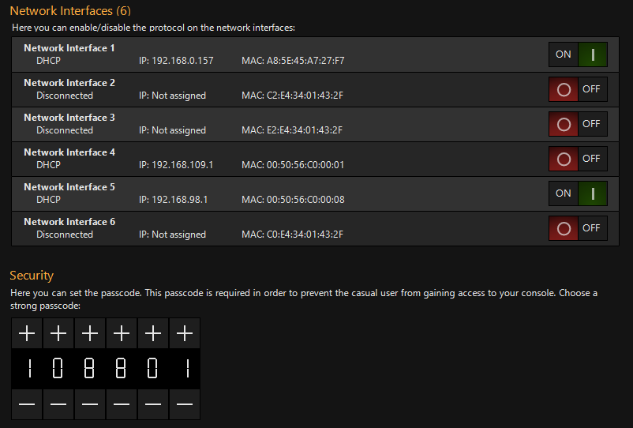
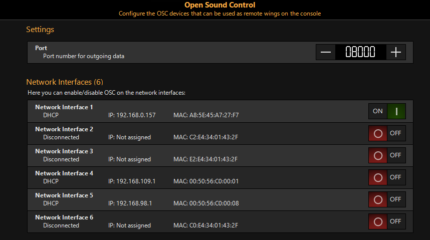
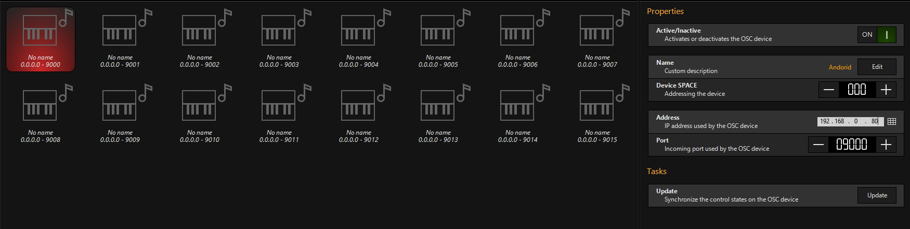

# Onyx über andere Wege steuern

Auch wenn wir mit MIDI und dem NX Touch eine gute Grundlage an Hardware haben kann es trotzdem schnell passieren das man mehr Fader/Knöpfe braucht oder eben die Möglichkeit Onyx kabellos zu steuern. Um die verschiedenen Möglichkeiten Onyx zu steuern soll es hier gehen.

### Grundlagen

Alle hier gezeigten Möglichkeiten sind Wireless, aber sie müssen trotzdem mit dem PC auf dem Onyx steuert verbunden sein. Wie man das genau anstellt hängt dabei ab ob man das NX-Touch oder Enttec benutzt.

##### Output über NX Touch

Da das NX Touch via USB Kabel an den PC angeschlossen wird ist das Setup für Wireless Control relativ simpel. Man muss nur ein lokales Internet aufbauen (Wlan ohne Internet Anschluss) und PC und den Controller anmelden. Soweit Möglich ist eine Lan-Kabel Verbindung natürlich vorzuziehen. 

Am einfachsten lässt sich ein solches Netzwerk über einen Router erstellen. Sobald der Router angeschaltet wird kann man sich mit ihm entweder per Kabel oder Wireless verbinden. Sobald beide Geräte verbunden sind (und Onyx entsprechend Konfiguriert wurde) kann ein Datenaustausch zwischen den einzelnen Geräten stattfinden.

##### Output über Enttec

Da es sich bei dem Enttec der Schule um ein Art-Net Gerät handelt haben wir das Problem dass im Normalfall der PC sich nicht zusätzlich noch mit einem Router verbinden kann. Allerdings lässt sich das Problem umgehen indem man Enttec via LAN-Kabel an den Router anschließt. Das Enttec selber hat mit dem zusätzlichen Datenverkehr kein Problem. 

Allerdings sollte man es vermeiden Art-Net Geräte wirelessly zu betreiben. Das hat rei Gründe:

1. Stability. Verbindungen über Wlan sind nicht immer 100% stabil, es kann zu Packet Loss kommen. Im Normalfall ist das kein Problem (die meiste Software kann mit sowas umgehen), für eine DMX Verbindung stellt das allerdings ein großes Problem da. DMX wird kontinuierlich geupdated (alle 23ms), fehlen Pakete kann es zu Aussetzern kommen
2. Latency. Die Latenz von Wired Verbindungen ist viel geringer als die von Wireless Verbindungen. 2-4ms vs. 30-120ms. Aucj das kann zu ungewolltem Verhalten führen.
3. Size. Jedes Art-Net Signal hat eine theoretische Größe von 4,5kBit. Diese Datengröße wird alle 23ms übertragen. Das klingt nach nicht wirklich viel (selbst der langsamste Wlan Standard 802.11b hat einen Durchsatz von 11MBits/s) . Werden allerdings mehrere Universen übertragen vervielfacht sich die Datenmenge und sollten dann auch noch andere daten (wie zum Beispiel zwischen Onyx und einem IPad)  kann es schnell dazu führen das das Netzwerk überlastet ist

##### Onyx Konfiguration

In einem der ersten Kapitel wurden die Network Settings erklärt. Dabei hieß es das ihr alle interface Options auf `ON` stellen sollt. Diese werden wir jetzt brauchen. Dabei stehen die verschiedenen Optionen für folgende Funktionen

| Option      | Funktion                                                     |
| ----------- | ------------------------------------------------------------ |
| X-Net       | Ermöglich die Kommunikation zweier PCs. Dabei ist ein Pc der Mater und ein PC der Slave |
| Onyx Remote | Wird für die Onyx Remote App benötigt                        |
| sACN        | Streaming ACN                                                |
| CITP        | Media Playback über Onyx. irrelvant für uns                  |
| OSC         | erlaubt das empfangen und senden von OSC Daten über das gewählte Interface |


### Onyx Remote App

Bei der Onyx Remote App handelt es sich um eine App direkt Entwickelt von Obsidian Control Systems die für IOS verfügbar ist. Die Verbindung zwischen App und PC ist einerseits schnell und unkompliziert allerdings halten sich die Funktionen der App auch in Grenzen. Am besten kann man sie benutzen um alleine Scheinwerfer auszurichten. Für Live Playback ist sie eigentlich nicht geeignet. 



In Onyx muss für das genutzte Interface das Protokoll aktiviert werden. Danach sollte man noch ein Passwort festlegen damit nicht jeder der ei IPad hat sich einfach mit der Shot verbinden kann. 

In der App muss man beim Verbinden den entsprechenden Passcode noch eingeben und dann ist alles fertig. 

In der App selber kann man Fixtures auswählen, Presets auswählen, Parameter verändern und Playback Buttons triggern. Leider habe ich kein IOS Gerät deswegen kann ich keine Bilder zeigen.

### Onyx Master Slave

Es ist möglich mehrere PC's mit Onyx oder Konsolen miteinander über das Netzwerk zu verbinden. Dabei wird das Onyx eigene X-Net Protokoll verwendet und die Konsolenlaufen in einer Master Slave Konfiguration.

Die Master Konsole ist dabei für den DMX Output und für das speichern der Showdaten verantwortlich. Trotzdem werden die Date zwischen allen Konsolen synchronisiert und jede Konsole hat die gleiche Priorität was Playback angeht. Folgende Daten werden synchronisiert:

- Cue und Preset Data
- Playback Data
- Programmer Data
- Patch Data
- X-Net chat
- Workspace Data

Ein Vorteil von der Master Slave Konfiguration über andere Arten des Remote Playbacks ist das es möglich ist den DMXOutput zu wechseln sollte die Master Konsole Probleme haben. Findet der Output über DMX statt oder ist nur eine Konsole an ein Art-Net/sACN Node angeschlossen reicht ein simples wechseln der Kabel. 

Praktischer ist es allerdings wenn der DMX Output nur über Art-Net läuft und beide Konsolen im gleichen Netzwerk sind wie das Node. Damit es nicht zu Fehlern kommt muss zuerst Art-Net/sACN in den Netzwerkeinstelllungen der Slave Konsole ausgeschaltet sein.

Sollte ein Output Switch erforderlich sein reicht es Art-Net/sACN an der Master Konsole auszuschalten und an der Slave Konsole anzuschalten. 

##### Wie mit einer anderen Konsole Verbinden?

Zuerst sicherstellen das sich beide Konsolen im gleichen Netzwerk befinden. Dann folgende Schritte bei der Slave Konsole befolgen

```
>> (Art-Net/sACN ausschalten) >> Onyx Menu >> Network Settings >> Shows >> der zu joinenden Schow auswählen >> Join >> Yes
```

Danach werden alle vorher genannten Daten zwischen den beiden Konsolen synchronisiert.

Von der Master Konsole aus gibt es außerdem die Möglichkeit die Slave Konsole als neuen Master festzulegen. Das ist besonders Praktisch wenn ein Neustart erforderlich ist. Vorher sollte man allerdings den DMX/Art-Net/sACN Output wechseln. 

Außerdem kann man an der Master Konsole dafür sorgen das Slave Konsole die Show verlassen 

### (Touch)OSC

OSC - Open Sound Control - ist eine weitere Möglichkeit für Remote Playback. Dabei kann man sich OSCwie Network MIDI vorstellen (mit dieser Idee wurde es auch konzipiert). Allerdings mit dem Nachteil das OSC nicht standartisiert ist wie MIDI. 

##### Wichtig! in der roten FREE Lizenz (also ohne angeschlossenes NX-Touch) sind OSC Inputs delayed. Die einzige Ausnahme ist das Keypad und die Encoder

Die beliebteste App für OSC ist TouchOSC (Android und IOS), theoretisch ist es auch möglich andere Apps zu benutzen allerdings habe ich damit keine Erfahrung.

##### Onyx Konfiguration

1. unter den Network Settings die IP-Adresse auf Automatic stellen und für das richtige Interface OSC erlauben (ToucOSC funktioniert nicht mit Art-Net zusammen)
2. Unter Network >> OSC die Port Data auf 08000 lassen und für das entsprechende Interface OSC erlauben 
3. Unter Devices ein gerät anschalten und einen Namen festlegen. Device SPACE bei 000 lassen
4. Danach die IP Adresse des OSC Gerätes eingeben. Wenn man TouchOSC benutz findet man diese unter "OSC" oder "Configuration"
5. Überprüfen ob die Port Nummern übereinstimmen. Bei touchOSC sollte die PORT (outgoing) Nummer 8000 sein und die Port (incomming) Nummer gleich der Port Nummer in den Onyx Einstellungen sein  

Jetzt kann TouchOSC benutzt werden

##### Tablet/Handy Konfiguration

Zuerst muss das Onyx Layout heruntergeladen und installiert werden. Das Layout gibt es [hier](https://files.obsidiancontrol.com/s/b7gYqqYSgdk3d7d). Alternativ kann man mit dem ToucOSC Editor auch sein eigenes Layout erstellen. 

Danach auf dem Handy die Host-IP Adresse eingeben (die der Konsole), sowie die Ports die man vorher festgelegt hat. Danach sollte alles funktionieren 

