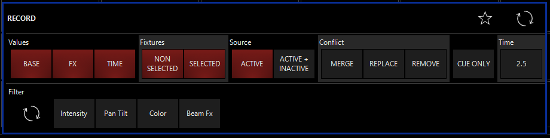
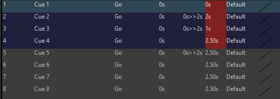
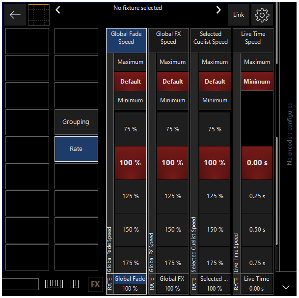

# Split Timings, Delays und Fade Times

Onyx gibt einem verschiedene Arten Fade Tims zu verändern und abzurufen. Die default Fade Time für jede Cue beträgt dabei 2.5 sekunden.

Die drei gängigsten sind dabei: 

- die einfache Fade Time
- Split Timings für effektvolle Fade Times die interessanter aussehen 
- Delays (verschieden Fadetimes für verschieden Fixtures innerhalb einer Cue)
- Global Fade Time um Timings aller Cues zu verändern 

### Die Fade Time ändern

es gibt 2 Arten die Fade Time einer Cue zu ändern. Die erste ist diese direkt beim recorden der Cue einzustellen. Dafür im Record Filter Menü 



auf Time drücken. Danch önnet sich über dem Filter Menü eine Leiste in der verschiedene Fade Times ausgewählt werden können. Diese Auswahl lässt sich unter 

```
>> Onyx Menu >> Cue Settings >> Cue Fade Times
```

einstellen.

 Möchte man die Fade Time einer oder mehrerer Cues nach dem Recorden ändern ghet das so:

```
>> Cueliste auswählen >> in der Sidebar Cuelist Values auswählen >> 
```

eine genauere Erklährung für alle Funktionen erfolgt im nächsten Kapitel.  


Um die Fade Time einer Cue bearbeiten zu können muss zuerst der `EDIT MODE ` aktiviert werden. Dafür auf `EDIT MODE ` neben dem Cuelist Namen drücken. ist der Edit Mode aktiviert kann man unter `FADE` eine oder mehrere Cues auswählen (ausgewählte Cues werden rot makiert) 



und über das ComandPad oder die Tastatur eine neue Fade Time einstellen. Danach noch mit Enter bestätigen und die neue Fade Time ist eingestellt. Wie man in der Befehlszeile ablesen kann steht dort folgender Befehl:

`SET CUE "x"FADE @ ` . Genaus wie bei jedem anderen Befehl auch kann man diesen Befehl komplett über das ComandPad eingeben wenn man möchte.

### Split Timings

Eine Split Timing bedeutet das Fixtures die ausfaden (down-move) eine andere Fade Time haben als Fixtures die einfaden (up-move). Um eine Split time einzustellen wieder in den View CueList Values wechseln und die Fade Time einer oder mehrerer Cues auswählen. Statt einer einzelnen Zahl geben wir zwei Zahlen unterteilt mit dem "/" ein. Die erste Zahl ist dabei die Fade Time für den up-move, die zweite Zahl die Fade Time für den down-move. Dnach wieder mit Enter bestätigen.

### Delays

Ist ein Delay eingestellt ahben verschieden Fixtures verschieden Fade Times. Dadurch können Fixtures z.B von links nach recht eingefaded werden oder aber Pan Tilt bewegungen verzögert werden. Ein Delay kann entweder nur fpr eine Attributsgruppe eingestellt werde pder für alle. Um ein Delay einzustellen:

```
>> Fixtures auswählen >> Delay im CommandPad drücken >> ggf in der CV eine Attributsgruppe auswählen >>zwei Zahlen die mit dem "Thru" befehl untertielt werden eingeben >> Enter drücken
```

Die erste Zahl ist dabei die Fade Time für die erste Fixture, die zweite Zahl die Fade Time für die letzte Zahl. Die Fade Times für die anderen Fixtures werden dann automatsch gleichmäßig vergeben. 

Ist die Cue bereits recorded und will man nachträglich eine Delay Time einstellen geht das nicht im CueList Values View. Der Reiter Delay steht dort für die Zeit die verstreicht bis die Cue eingefadet wird nachdem der `GO` Command gegeben wurde. Stattdessen muss die Cue mit der Edit Funktion bearbeitet werden. Wie genau die Edit Funktion funktioniert kommt in einem anderen Kapitel.

Genauso wie Masks können auch Delay Times als Preset gespeichert werden. Zu beachten ist allerdings das wenn ein Delay Preset bei den Intensity Presets recoreded wird, die Delay Time auch nur für die Intensity Attribute eingestellt wird.

### Global Fade Times

Mit den Global Fade Times lassen sich die Fade Times aller Cues (oder nur einer einzelnen) spontan verändern. Diese Änderung ist jederzeit wieder rückgängig machbar.

Um die Global Fade Times zu öffnen muss die Channel Visualization geöffnet werden und auf `RATE` gedrückt werden. Danach sieht die CV so aus:



#### Global Fade Speed:

Global Fade Speed beduet die Fade Times ALLER Cues zu verändern. Die Werte reichen dabei von 1% zu 2000%. Wichtig ist das diese Werte multiplikativ sind. Hat Cuelist 1 eine fade Time von 20 sec und Cuelist 2 eine Fade Time von 10 sec und ist der Global Fade Speed 200% (also doppelt so schnell) ist die angewendete Fade Time von Cue 1 10 sec und von Cue 2 5 sec. 

#### Global FX Speed

hat die gleiche Wirkung wie Global Fade Speed, aber die Veränderungen haben nur Einfluss auf den FX Speed nicht auf sonstige recordete Timings.

#### Selectecd Cuelist Speed

Diese Option tritt nur auf wenn zurzeit eine Cuelist ausgewählt ist. Auch diese funktioniert wie der Global Fade Speed, verändert aber nur die Fade Times der aktuell asugewählten Cuelsits nicht aller. Wichtig zu beachten ist aber das Global Fade Speed und Selected Cuelist Speed kumulativ funktionieren. Heist  also das wenn beide Speeds auf 200% stehen die Fade time der ausgewählten Cuelist 4 mal so schnell ist.

#### Live Time 

Live Time hat keinen einfluss auf fade Times sondern darauf wie schnell Werte vom Programmer ge-outputed werden. Die Werte gehen von 0 bis 60 Sekunden. Die eingestellte Live Time gilt auch wenn man den Programmer cleared.