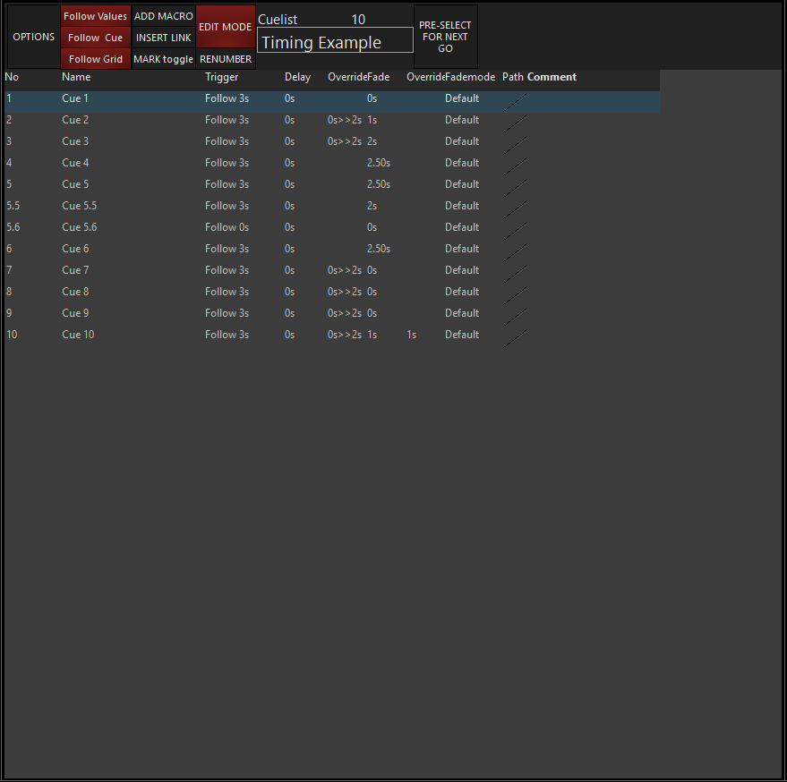
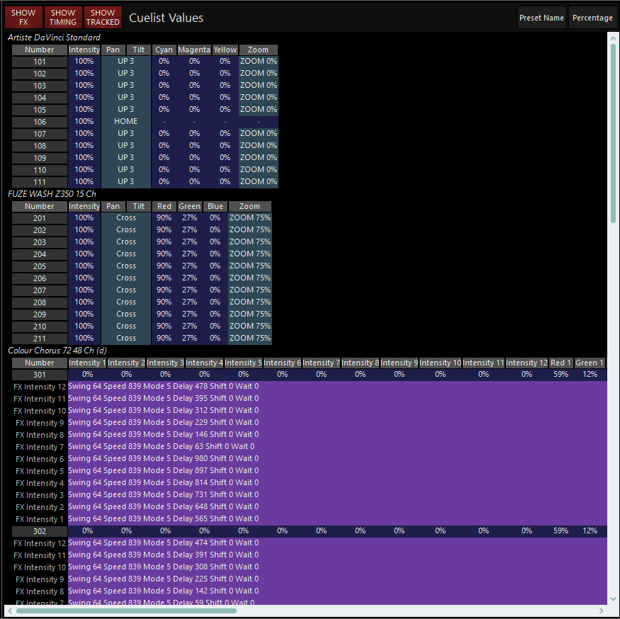
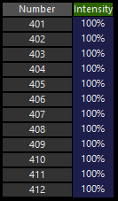
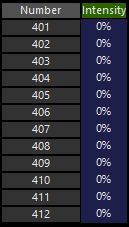
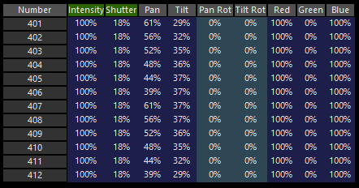
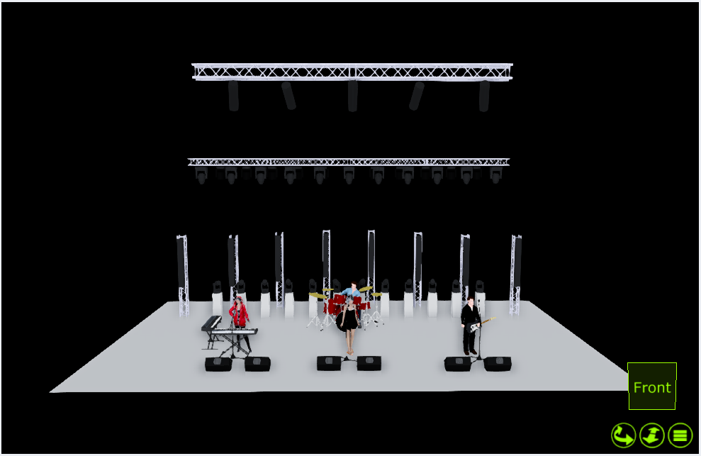
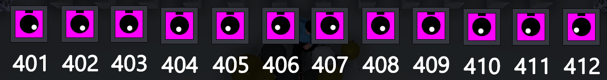
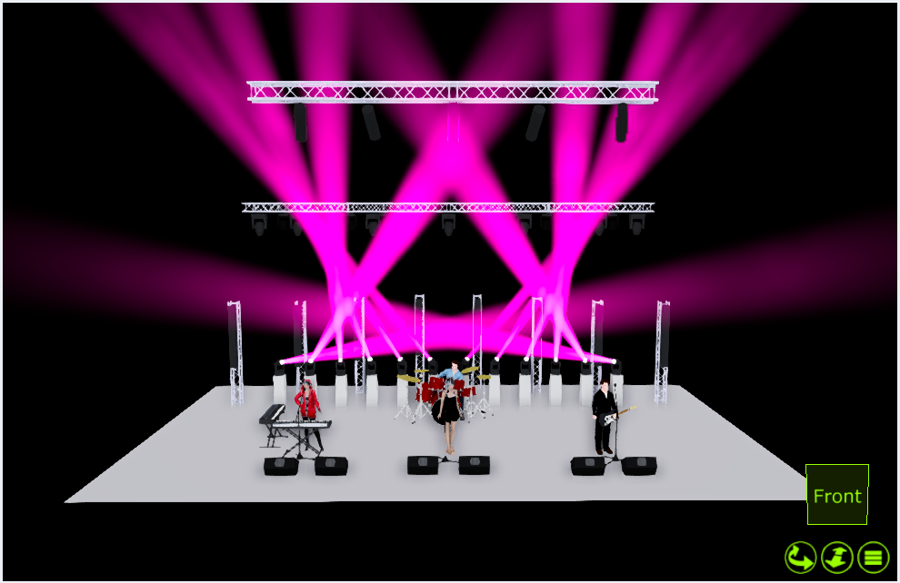

# Cuelist Values und Move in Black

Im View `Cuelist Values` können veränderungen an Cuelists vorgenommen werden, Timings geändert werden, (MIDI)-Macros eingestellt werden etc. 

Eine weiter Wichtige Funktion des Cuelist Values VIews ist die Funktion Move In Black. 

### Cuelist Values

Wie bereits erwähnt muss man um z.B die Timings einer Cue zu bearbeiten die entsprechende Cue auswählne und dann in der Sidebar auf Cuelist-Values drücken. Alleridngs kann man dort auch noch mehr als nur Fade Times einstellen:

Auf der Linken Seite gibt es die Möglichkeit die Cue zu bearbeiten, auf der rechten Seite kann man sehen was in den einzelnen Cues recorded ist.

Fangen wir  mit der linken Seite an:



Dieses Fenster wird auch `Selected Cuelist Window gennant` und kann unter diesem Namen im View Editor gefunden werden.

Die Knöpfe am oberen Rand haben folgende Funktionen:

| Option                        | Erklährung                                                   |
| ----------------------------- | ------------------------------------------------------------ |
| `OPTIONS`                     | eine weiter Möglichkeit die Optionen einer Cuelist zu öffnen |
| `FOLLOW VALUES ` (default On) | Alle drei Einstellungen verändern das Verhalten des Cuelist values Views. Sie haben keien Einfluss auf die Cuelist. |
| `FOLLOW CUE` (default On)     |                                                              |
| `FOLLOW GRIND` (default On)   |                                                              |
| `ADD MACRO`                   | Fügt ein Macro an der Cue hinzu die ausgewählt wurde. Im Kapitel Macros dazu mehr |
| `INSERT LINK`                 | Fügt einen Cuelist Link hinzu an der Cue die ausgewählt wurde. Im Kapitel Macros dazu mehr |
| `MARK TOGGLE`                 | Aktiviert bzw deaktiviert Move In Black                      |
| `RENUMBER`                    | Ermöglicht es die Position einer ausgewählten Cue in der Cuelist zu verändern. |
| `EDIT MODE`                   | Ermöglicht zugriff auf `ADD MACRO; INSERT LINK; NAME; TRIGGER; DELAY; FADE; FADE MODE; PATH; COMMENT` |
| `PRE-SELECT FOR NEXT GO`      | wenn aktiviert wird der nächste `GO ` Befehl nicht die nächste Cue in der Cuelist auslösen sondern die im Cuelist Values View ausgewählte Cue. Die Cue wird in dem falle über die Nummer ausgewählt. |

Will man den Namen der Cuelist ändern:

```
>> Edit Mode >> auf den aktuellen Namen klicken >> neuen Namen wählen >> Enter drücken
```

Unter den grade besprochenen Knöpfen sind 8 Spalten:

| Option                         | Erklähurng                                                   |
| ------------------------------ | ------------------------------------------------------------ |
| `NO`                           | Die Nummer der Cue. Kann geändert werden wenn `RENUMBER` aktiviert ist |
| `NAME`                         | Der Name der Cue.                                            |
| `TRIGGER`                      | Die Trigger Typen `GO: WAIT: FOLLOW` können hier ausgewählt werden. Weiter unten dazu mehr |
| `DELAY`                        | Delay Timing, die Zeit die gewartet wird bevor die nächste Cue eingefaded wird |
| `FADE`                         | Die fade Time                                                |
| `FADE MODE`                    | Es gibt drei verschiedene fade Modi                          |
| `FADE MODE::DEFAULT FADE`      | Alle Attribute werden so eingefaded wie sie recorded wurden  |
| `FADE MODE::SNAP ALL CHANNELS` | Alle Attribute haben eine Fade Time von 0, rercordete Fade times werden überschrieben |
| `FADE MODE::FADE ALL CHANNELS` | Alle Attribute werden mit der recordeten fade Time eingefadet, auch Attribute die normalerweise snappen |
| `PATH`                         | Der `PATH` ist der Style in der der fade erfolgt             |
| `PATH::LINEAR` (default)       | Der Fade hat über die komplette Zeit eine gleichbleibende Geschwindigkeit |
| `PATH::ACCELERATE`             | Die Geschwindigkeit startet langsam und wird immer schneller |
| `PATH::BREAK`                  | Die Geschwindigkeit startet schnell und wird immer langsamer |
| `PATH::ACCELERATE-BREAK`       | Geschwindigkeit startet langsam, wird schneller und dann wieder langsamer |
| `PATH::SHAKE`                  | Die Geschwindigkeit ändert sich konstant                     |
| `COMMENT`                      | Ermöglicht es einen Comment mit max. 21 Zeichen hinzuzufügen |


Die Rechte Seite sieht folgendermaßen aus:



In diesem Fenster sieht man was alles in der grade ausgewählten bzw. grade aktuellen Cue gespeichert ist. Über die Knöpfe `SHOW FX` `SHOW TIMTING` und `SHOW TRACKED` kann man noch auswählen was alles angezeigt werden soll. Rechts oben kann man wie im Programmer auch wechseln ob er die Preset Namen oder die Attribut-Werte zeigen soll.

### MARK oder Move in Black

Move in Black (in Onyx MARK genannt) bedeute das Onyx manche Attributs Änderungen automatisch vornimmt. Zum Beispiel kann eine Pan Tilt Position erreicht werden noch bevor die Scheinwerfer angehen. Um MARK zu benutzen muss in der Cuelist ein Intensity Wert recorded sein. Dieser kann auch getracked sein. Sobald der Intensity Wert 0% hat wird das MARK ausgeführt.

#### Beispiel für die MARk Funktion:

Zuerst wird eine Cuelist mit drei Cues recorded. 

In Cue 1 befinden sich folgende Werte:

Cue 2 sieht so aus:							   

Und in Cue 3 diese Werte: 

Analog zu den Werten in Cue 1 würde Cue 1 auf der Stage so aussehen: 

Wenn Cue 2 gestarted wird sieht diese auf der Bühne so aus: 



Betrachten wir Cue 2 allerdings im 2D Plan sehen wir allerdings das die Farbe und die Position von Cue 3 bereits eingenommen wurden. 

Dadurch gibt es keinen Fade der Pan Tilt Werte der manchmal nicht gewollt sein kann.

Sobald Cue 3 gestartet wird faden die Intensity Werte ein und wir haben den Stage Look erreicht ohne einen Sweep der Position.



## WICHTIG: Fixtures deren Intensity Wert NuLL ist werden nicht gemarked

Die mark Funktion verändert keine Cuelist Values und kann jederzeit an und wieder ausgeschaltet werden.

Es gibt zwei Arten von MARK: Mark per Cuelist und Mark per Cue. 

#### Mark per Cuelist 

Mark per Cuelist bedeuted das Onyx alle Cues innerhalb einer Cuelist versucht zu marken. Um Mark per Cuelist zu aktivieren:

```
>> Cuelist Options der entsprechenden Cuelist öffnen >> Unter Tracking "MARK per Cuelist" auswählen
```

Wenn erfolgreich steht im Cuelist Values Fenster "MARK per Cuelist" unter dem Namens-Feld. Danach muss die Cuelist noch einmal released werden um die neuen Änderungen zu aktivieren.

#### Mark per Cue

Bei Mark per Cue kann man selber auswählen welche Cues innerhalb einer Cueliste gemarked werden sollen. Dafür:

```
>> Cuelist Options der entsprechenden Cuelist öffnen >> Unter Tracking "MARK per Cue" auswählen
```

Danach im Cuelist Values View eine Cue auswählen und auf `MARK TOGGLE` drücken. Ein Rotes M steht dann neben der Cue. 