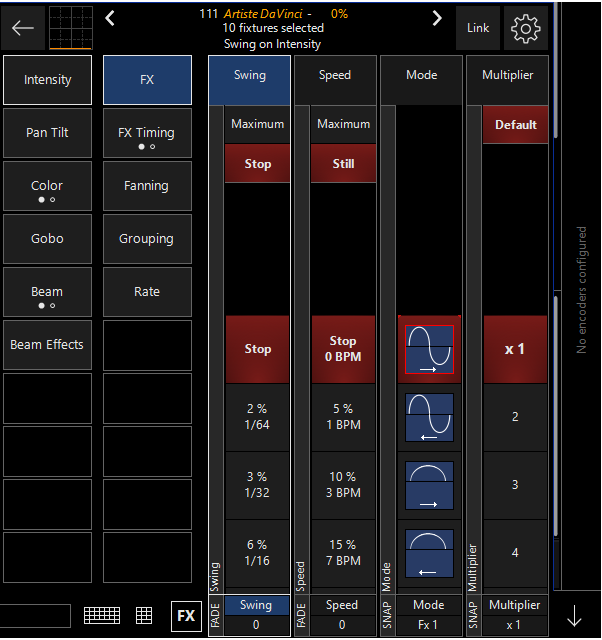
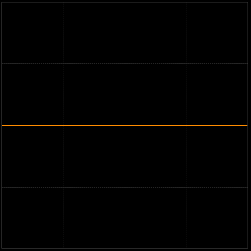
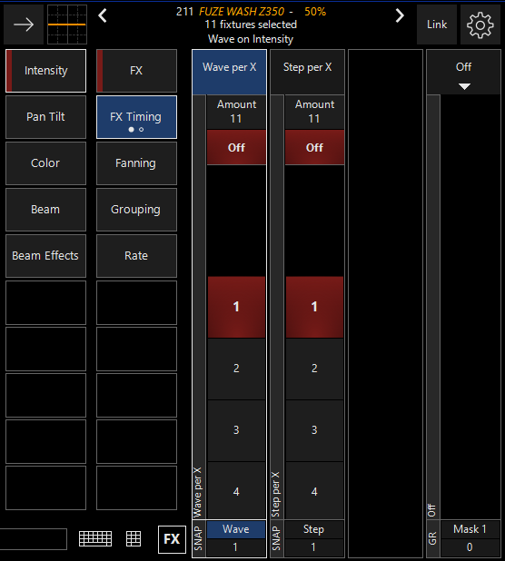
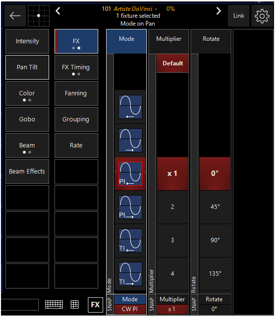
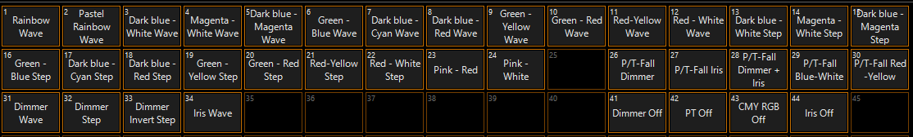
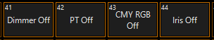

# FX Basics

Es gibt im Grunde drei Arten von FX, Intensity FX, Pan/Tilt FX und FX Macros. Streng genommen kann man mit den FX Parametern auch Farbeffekte erstellen allerdings sind diese in Onyx kompliziert. Um Farbeffekte effizient zu erstellen benötigt man Dylos (ab Onyx Version 4.4.xxxx). Im Prinzip kann man aber für jede Attributsgruppe einen FX erstellen.

Jeder FX besteht aus einer Baseline, einem Swing Value, einem Speed Value und einem Mode. Die einzige kleine Ausnahme sind Pan/Tilt FX, diese haben jeweils eine Pan Swing und einen Tilt Swing. Der Baseline Wert ist der Wert von dem der FX immer startet. Swing wird in Prozent angegeben und ist die Modulation nach oben oder unten des Baseline Wertes. In der audio Welt würde man das Amplitude nennen. Speed ist die Geschwindigkeit (Prozentual abhängig von der BPM zahl). Der Mode ist die Richtung und Art und Weise auf die der Swing Wert angewendet wird (Der Multiplier Wert bezieht sich auf die Geschwindigkeit des FX).

Der Baseline Wert kann in der Cue in der der FX recorded wird gespeichert sein, kann aber auch getracked werden. Onyx ermöglicht es auch den Baseline Wert über andere Cuelisten festzulegen was mehr Flexibilität ermöglicht. Außerdem ist es möglich die FX Parameter bei der Erstellung unrecoreded zu lasen und diese stattdessen in Overrides zu speichern. In diesem Abschnitt geht es allerdings nur um die Basics, deswegen werden wir für den Anfang alle FX Attribute in einer Cue speichern.

### Intensity FX

(Möchte man einen FX für einen anderen Attributsytyp erstellen funktioniert das analog zu dem hier gezeigten. Die einzige Ausnahme sind Pan/Tilt FX)

Zuerst wird eine Gruppe von Fixtures ausgewählt und den Attributstyp ausgewählt bei dem ein FX hinzugefügt werden soll. 

Der als letztes ausgewählte Attributstyp steht am oberen Rand der CV. 


In diesem fall nehmen wir Intensity. Danach auf den FX Knopf drücken um die FX Encoder zu öffnen



Die FX Sektion besteht aus 2 Teilen: Der FX Teil bei dem Swing, Speed Mode und der Multiplier ausgewählt wird und der FX Timing Teil bei dem man Wave/Step bzw Delay, Shift und Wait einstellen kann. Für den ersten FX ignorieren wir FX Timing. 

Sind Swing, Speed Mode und Multiplier gewählt kann man die Cue wie jede andere Cue auch entweder als neue Cuelsit speichern oder zu einer bereits bestehenden Cuelist hinzufügen. 

Für eine graphische Repräsentation des gewählten Attributstypes kann man sich folgende Graphik angucken:

Der gelbe Streifen repräsentiert den Intensity Wert der Fixture Group. In diesem Fall ist er grade bei 50%. 

### FX Timing

(Intensity FX) bei denen alle Fixtures das gleiche machen können schnell langweilig sein. Deswegen gibt es den FX Timing Bereich.



durch erneutes drücken auf FX Timing kann man zischen den 2 Seiten wechseln. 

Auf der ersten Seite befinden sich Wave per X und Step per X: 

| Option       | Erklähurng                                             |
| ------------ | ------------------------------------------------------ |
| `WAVE PER X` | Der ausgewählte Mode wird über x Fixtures verteilt.    |
| `STEP PER X` | Wendet den ausgewählten FX genau auf X Scheinwerfer an |

Wie man sieht ist es schwer Wave und Step in Worten zu erklären, es macht am meisten Sinn die beiden Funktionen einfach auszuprobieren. WICHITG: Wave und Step sind nicht kompatibel, man kann nur ein von beiden anwenden.

Auf der zweiten Seite von FX Timing findet man Delay, Shift und Wait. Diese Werte haben den gleichen Effekt wie Wave/Step und es gibt keinen Grund diese zu benutzen da ave/step viel einfacher sind. Wer wissen möchte was sie genau tun kann im Onyx Manual nachgucken. 

### Effekt Grouping

Unter FX Timing findet man auf der rechten Seite noch `GR` also die Möglichkeit Group Masks auf den FX anzuwenden. Um Grouping Masks zu aktivieren auf den Pfeil bei Off zu drücken. Ein Drop-Down Menu erscheint mit allen Mask Optionen. Unter Grouping hat man auch zugriff auf die Grouping Actionen wie Revert Invert etc. 

Für eine genaue Erklärung von Masks, Grouping etc Kapitel 10 lesen.

### Pan Tilt FX

Unter den Einstellungen der CV ist per Default die Funktion `P/T Kombo` aktiviert. Diese Einstellung macht es einfacher Pan Tilt FX zu erstellen und sollte in den meisten Fällen auch aktiviert bleiben. Wird sie deaktiviert sieht der FX Bereich von Pan/Tilt genauso aus wie bei den anderen Attributstypen. 

Zusätzlich zu Swing Pan und Swing Tilt (deren Funktionen analog zu der Swing Funktion der Anderen FX ist) gibt es eine neue Einstellungsmöglichkeit: Figure. In Figure sind verschieden Bewegungen vor eingestellt die die Fixtures ablaufen. Den genauen Weg kann man Über P/T Swing beeinflussen.



Wie man sehen kann ist außerdem eine neue FX Seite hinzugekommen. Auf der zweiten Seite kann man folgendes einstellen:

| Option      | Erklährung                                                   |
| ----------- | ------------------------------------------------------------ |
| `MODE`      | Mode ermöglicht es die Richtung des FX zu ändern. Die Buchstaben `PI` bzw `TI` stehen für `PAN INVERT` und `TILT INVERT` |
| `MULTPLIER` | gleiche Funktion wie bei anderen FX                          |
| `ROTATE`    | Ermöglicht es einen Teil oder alle Fixtures um X grad zu drehen. Kann man entweder benutzen weil jemand Scheinwerfer falsch herum aufgehangen hat oder um kreative neue Effekte zu erstellen |

ist alles eingestellt kann man den FX genauso wie den anderen einfach abspeichern.

#### Zusammenfassend:

```
>> Fixtures auswählen >> FX Attributstyp wählen (Int P/T etc) >> ggf Baseline wählen >> FX Swing, Speed und Mode einstellen (bei P/T zusätzlich Figure) >> (Grouping/Masks) >> FX abspeichern 
```

### FX Makros

Wer keine Lust hat selber einen FX zu programieren kann statdessen ein FX Makro benutzen. FX Makros isnd nichts weiter als FX Presets (vergleichbar mit denen die ihr am Anfang selber erstellt habt) nur das diese FX Attribute speichern und von Obsidian vorprogrammiert wurden. Dieser View heißt FX Program



diese lassen sich genauso wie andere Presets auch anwenden. Also erst Fitures auswählen und dann den gewünschten FX anklicken. Diese FX können natürlich auch selber bearbeitet werden, bevor sie als Cuelsit gespeichert werden. Am wichtigsten sind hier warscheinlich die Farb FX, besonders der Rainbow Wave FX da Farbeffekte in Onyx schwer und umständlich zu erstellen sind

Genau wie Presets auch können FX Makros bzw FX Presets auch vom Benutzer selber gespeichert werden. Allerdings gibt es ein paar Unterschiede.

-  Im Gegensatz zu normalen Presets kann man hier ein FX Makro mit Stariville MH 110's speichern und es später auf Martin Vipers anwenden. Dabei ist zu beachten das Onyx sein bestes gibt die gespeicherten Attribute auf die Fixtures zu verteilen. FX Makros sind also global.
- Auserdem sind FX Makros nicht "referenced", das heißt das, verändert man das Makro ändern sich nicht auch automatisch alle Cues in denen das Makro verwendet wurde. 

Wer FX Makros benutzt wird schnell merken das im CV der Link Button leuchtet. Das bedeutet das mehrere Attribute sich gleichzeitig verändern. Darauf wird später noch genauer eingegangen, bis dahin einfach den Link Button, nach speichern des Makros, drücken um die Funktion wieder auszuschalten

### Ein paar Worte zu FX

#### FX und tracking

Wie wir ja beriets wissen ist Onyx eine Tracking Konsole. Obwohl FX nicht reelle Werte repräsentiert wie zum Beispiel ein Intenstiy Wert werden FX Attribute trotzdem gettracked. Befindet sich in Cue 1 ein FX und wurde dieser in Cue 2 nicht ausgeschaltet wird dieser weiterlaufen. Deswegen kann es Sinn machen bei FX die `CUE ONLY ` Option beim recorden zu benutzen. 

#### FX beenden

Möchte man einen FX beenden, reicht es eine Cue zu recorden in der der Swing Wert auf 0% gesetzt ist. Entweder recorded man eine Cue für alle FX und alle Scheinwerfer oder man teilt diese Funktion auf. 

Man kann diesen FX "stomp" entweder als Cuelist oder als Override recorden. Als Cuelist funktioniert er als Knopf der sobald er betätigt wurde den FX stoppt (Als Errinerung, der Cuelist Fader hat nur Einfluss auf die Intensity). Als Override bekommt man nicht nur die Möglichkeit den FX zu stoppen, man kann auch seinen Swing zur reduzieren was einem eine weiter Möglichkeit der Kontrolle gibt. Diese Stomps gibt es auch als Presets unter FX Makros (Sie tragen die Namen: Dimmer Off, PT Off, CMY RGB Off, Iris Off)



#### FX speichern

Am natürlichsten erschient es einen FX als Cuelist zu speichern. Man drückt auf Go und der FX faded ein. Eine andere option wäre wieder der Override. Asl Override kann man mit dem Fader alle FX Attrinute steuern. Ein P/T FX mit 50% des Override Fader hat entsprechedn 50% weniger Swing und ist 50% langsamer. Auch das bedeutet mehr Flexibilät. Am ende kommt es allerdings darauf an um was es sich für eine FX handelt und wie man ihn benutzen möchte.

#### FX Timing

Wie man Wave bzw Step benutzt ist natürlich jedem selber überlassen. Allerdings gibt es ein paar Sachen die man beachten kann. 

- Wave und Step ist genauso wie alles andere auch von der Reihenfolge wie die Fixtures ausgewählt wurden abhängig. 
- Für die meisten FX ist Wave die richtigere Wahl. Step bietet häufig einfach zu wenig da es sich immer nur auf eine kleine Anzahl von Fixtures bezieht.
- Egal ob Wave oder Step, ist die Anzahl der Fixtures durch den X Wert von Wave/Step teilbar ist der FX symmetrisch. In den meisten Fällen sieht das auch besser aus. Macht man allerdings einen P/T FX bei dem es eher darauf ankommt **das** sich Movingheads bewegen anstatt **wie** sie sich bewegen macht es häufig Sinn eine Zahl zu nehmen die einen unsymmetrischen FX erzeugt

