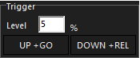

# Playback, mit und ohne Hardware	

Die Playback Möglichkeiten für eine Show hängen stark von den Hardware Möglichkeiten ab. Am Anfang beschränkt sich diese Sektion nur auf Software Playback bzw auf Software Playback in Verbindung mit einem MIDI Controller. Sollte in Zukunft Onyx Hardware zur Verfügung stehen werde ich diese Abschnitt für die Entsprechende Hardware updaten. 

(Sobald das NX-Touch da ist wird hier der Playback hier erklährt. )

### Playback Grundlagen

Wie bereits im Kapitel Cues besrprochen gibt es drei Arten von Playbacks: Main Playback, Sub Playback und Playback Buttons.

Main Playback bietet auf Software Seite 4 Buttons zu jedem Fader. Diese sind per default `GO, Pause/Back, Select, Flash`. Diese lassen sich aber in den Cuelist Options unter dem Reiter `FUNKTION ASSIGNMENT` frei belegen (dazu gleich mehr). 

Sub Playback dagegen bietet nur einen Button. Sub Playbacks finden sich außerdem nur auf der NX4 Konsole.

Playback Buttons sind Software basierte Buttons die per Touchscreen, Mausklick oder MIDI Controller eine Cellist triggern.

### Playback Buttons

Für uns am wichtigsten sind die Playback Buttons. Den entsprechenden View `PLAYBACK BUTTONS` findet man auf der Sidebar. Am oberen Rand des View befinden sich verschieden Knöpfe mit denen man die Playback Buttons triggern, releasen etc kann. Um eine Aktion bei einer Cuelist auszuführen, erst auf die Aktion drücken und danach passiert diese Aktion für alle Cuelistst die man anklickt.


| Aktion                | Erklährung                                                   |
| --------------------- | ------------------------------------------------------------ |
|    | Custom, wenn aktiviert wird die Down bzw Up Action ausgeführt. Per Default ist diese Go, sie lässt sich allerdings in den Optionen unter `FUNCTION ASSIGNMENTS` ändern. |
|    | Go, triggert eine Cuelist bzw triggert die nächste Cue.      |
|    | Pause, pausiert die Fade Time einer fadenden Cue.            |
|    | Release, released die Cuelist.                               |
|    | Select, wählt/selected die Cuelist.                          |
|    | Direct Cuelist Access, ermöglicht es ein Pop-Up zu öffnen mit den gleichen Kontrollmöglichkeiten wie eine Cuelist die bei einer Main Playback Bank gespeichert ist, inkl. Fader. |
|    | Direct Cue, öffnet ein Popup mit allen Cues die in einer Cuelist enthalten sind. Ermöglicht es direkt zu einer bestimmten Cue zu springen. |
|    | Multiselect, ermöglicht es mehrere Cuelists auszuwählen um allen gleichzeitig einen `GO` oder `RELEASE` Befehl zu geben. Um diese Funktion zu benutzen erst Mulstiselct auswählen , dann mehrere Cuelsits und dann auf `GO` oder ` RELEASE` drücken. |
|    | Selection Cuelist, ändert das selection Verhalten wenn eine Cuelist einen Commadn bekommt. **Off**: wenn Go etc. dann wird die Cuelist nicht selectet. **On**: wenn Go etc. dann wird die Cuelist automatisch auch selected. **Chases (CH)**: nur Chases werden bei einem `GO` etc. selected, andere Cuelists nicht. |
|  | Optionen und Page Nummer                                     |

#### Verschieben etc von Cuelisten

Cuelisten können ohne Probleme kopiert, bewegt und "gelöscht" werden (achtung, es wird nur der Button gelöscht, die eigene Cuelist ist immer noch verfügbar)

Um eine Cuelsit zu bewegen: 

```
>> Move (oder Ctrl+M) >> Cuelist die bewegt werden soll >> neuen Ort der Cuelist drücken
```

Um eine Cuelist zu kopieren:

```
>> Copy (oder Ctrl) >> Cuelist die kopiert werden soll >> Ort der Cuelist drücken
```

Um eine Cuelist zu "löschen":

```
>> Delete (oder Ctrl + Shift + Del) >> Cuelist die gelöscht werden soll >> Enter
```

Um eine Cuelist komplett zu löschen:

```
>> Sidebar View "Cuelist Directory" >> Directory Window >> Delete (oder Ctrl + Shift + Del) >> Cuelist die gelöscht werden soll >> Enter
```

### Active Cuelist Window

alle gerade laufende Cuelists lassen sich mit dem Active Cuelsits Window anzeigen. (Im Compose Workspace zu finden im "Cuelist Directory" View)


Die Knöpfe am oberen Rand haben die gleiche Funktion wie die der Playback Buttons. 

Am unteren Rand gibt es die möglichkeit die laufenden Cuelists nach Art zu filtern. 

Es empfiehlt sich das Active Cuelist Window immer griffbereit zu haben. Bei vielen cuelists kann es schnell passieren das man den Überblick verliert und ausersehen eine Cuelist an ist die gar nicht an sein sollte. Über dieses Window lassen sich solche Fehler schnell beheben. 

### Beat Editor

Der Beat Editor erlaubt es (solange Global Rate aktiviert wurde) einen BPM Wert festzulegen mit dem man die Geschwindigkeit aller Chase Steps bestimmt. Der Beat Editor ist als Sidebar Function Key verfügbar


| Button                    | Erklährung                                                   |
| ------------------------- | ------------------------------------------------------------ |
|  | halbiert die aktuelle PM Zahl                                |
|  | Zieht vom aktuellen BPM Wert ab.                             |
|  | Die aktuelle BPM Zahl                                        |
|  | Fügt zum aktuellen MP Wert dazu                              |
|  | verdoppelt die aktuelle BPM Zahl                             |
|  | (nur verfügbar in der main toolbar) wenn gedrückt öffnet sich ein neues Menu in dem alle gelinkten Cuelists gezeigt werden |
|  | durch mehrmaliges tippen des BPM Buttons wird die BPM Zahl festgelegt |
|  | Beat Fader, zum einstellen des BPM Wertes                    |

​     

### Fader Banks als Views

Wir haben bereits über die Playback Buttons gesprochen und in welchem Umfang man sie einsetzen sollte. Allerdings sind die Playback Buttons nicht der einzige View der während des Live Playbacks relevant ist. 

2 weitere wichtige Windows sind das Playback Module und das Submaster Module.


Das Playback Window ist eine Nachahmung von Onyx Hardware und kann/sollte vor allen Dingen dann benutz werden wenn keine Hardware zur Verfügung steht. Die 10 fader korrespondieren zu den 10 Main Playback Fadern, die 10 Knöpfe auf der rechten Seite zu den Cuelisten die auf den Fader 11-20 liegen. Die 5 Knöpfe unter den Bank Switches haben (zur Zeit) keine Funktion. Auf der rechten Seite unter dem Grandmaster fader ist die "Main Go" Sektion. 

Nicht alle Funktionen der "Main Go" Sektion machen ohne Hardware Sinn. Die Funktionen sind darauf ausgelegt das man mit Fingern zwei Knöpfe gleichzeitig drücken kann. Trotzdem macht es Sinn die Funktionen zu kenne, teilweise kann es Sinn machen diese zu benutzen.

alle Funktionen bestehen aus dem halten von Knopf a und dem einmaligen drücken von Knopf b

| Kombination           | Erklärung                                                    |
| --------------------- | ------------------------------------------------------------ |
| `SNAP + MAIN GO`      | snapped die nächste Cue in der ausgewählten Playlist         |
| `SNAP + ANY GO`       | snapped die nächste Cue der Cuelsit zu dem der Go Command gehört |
| `SNAP + CUE XX`       | snapped cue XX in der ausgewählten Cuelsit                   |
| `SNAP + MAIN II/BACK` | snapped die Sue davor                                        |
| `SNAP + ANY PAUSE`    | snapped die Cue in der Cuelist zu der der Pause Command gehört |
| `SNAP + REL`          | alle Cuelisten werden Released (erst int zu 0 dann Rest) (Global Release) |
| `REL + SNAP`          | alle Cuelsiten werden released (alle Attribute gleichzeitig zu 0) (Global Release) |
| `REL + MAIN GO`       | Released die ausgewählte Cuelsit                             |
| `REL + ANY GO`        | Rleased die Cuelsit zu der der Go Command gehört             |

Mit entsprechender Hardware machen alle Funktionen durchaus Sinn. Ohne Hardware ist aber nur der Global Release wirklich sinnvoll. Alle Cuelisten zu releasen kann immer praktisch sein.

### Function Assignment

die Function Assignments sind ein Teil der Cuelsit Options. Dor kann das Verhalten der Fader, der Knöpfe über/unter den Fadern etc eingestellt werden.


Die einzelnen Knöpfe korrespondieren jeweils zu den Knöpfen die man auf Hardware findet bzw, die im Main Playback dargestellt werden. Wird die Funktion eines Knopfes verändert, ändert sich die Funktionen sowohl auf der Hardware als auch im Main Playback. Die Down-Action wird ausgeführt sobald der Knopf gedrückt wird, die Up-Action sobald der Knopf losgelassen wird.

Für die Funktionen der einzelnen Knöpfe bitte im Onyx Manual nachgucken.

Das einzige was ich hier besonders erwähnen möchte sind die Einstellungen für das Fader Verhalten. Es gibt 4 Einstellungen:

#### Fader Option

| Option      | Erklährung                                                   |
| ----------- | ------------------------------------------------------------ |
| `-NOTHING-` | Der Fader hat keine Funktion mehr                            |
| `HTP`       | Setzt den Fader in HTP Modus                                 |
| `LTP`       | Setzt den Fader in LTP Modus                                 |
| `AB XFADE`  | Crossfade Modus. Wird der fader nach oben bewegt wird die nächste Cue getriggert, wird er wieder nach unten bewegt wird wieder die näcshte Cue getriggert. Währenddesen kontrolliert man die Fade Time dirket über die Bewegungsgeschwindigkeit des Faders. Praktisch für Theater Situationen bei denen man keine Fade Time vorher einstellen kann. (Teilweise kann es zu Problemen mit Split-Fade Times kommen, also Vorsicht) |

#### Fader Trigger Options



Es gibt 2 Optionen, `UP + GO` und ` DOWN + REL`. Up+Go bedeutet das die Cuelist automatisch getriggert wird sobald der fader nach oben bewegt wird. Über das Level lässt sich einstellen ab welchem Fader Wert die Cuelist den Go Command bekommen soll. Ist die Funktion Down+Rel ausgewählt wird die Cuelist automatisch released sobald der Fader 0% erreicht

### Flash Timings

Im Normalfall sind LEDs, wenn man sie flashed sehr harsch und direkt. Möchte man mit einer LED eher das Feeling eines traditionelleren Blinders haben muss man sich den Flash Timings zuwenden. Mit den Flash Timings kann man die Timings des Flash Buttons verändern.

Als erster Schritt muss man allerdings im Function Assigsnments Fenster den Timed Knopf auf `YES` stellen für den Flash Button. Das sollte dann so aussehen. Im Mai Playback ändert sic außerdem die beschriftung des Flash Buttons von `FLASH` zu ` T FLASH`.

*

Im Flash Timings Fenster gibt es drei Regler. Der erste Steuert Attack, der Zweite Hold und der dritte Decay.

- Attack ist die Zeit die vergeht bis die die Cue auf 100% ist. Quasi die Fade Time eines Flash Buttons
- Hold ist die Zeit die die Cue 100% behält nachdem der Flash Button losgelassen wird. Der maximal Wert ist hierbei "Infinite Hold" was bedeutet das die Cue solange auf 100% bleibt bis der Flash Button erneut gedrückt wird.
- Decay ist das Gegenteil von Attack, regelt die Zeit die de Cue braucht um auf 0% zurückzukehren.

In der Theorie kann die "Timed Yes" Option für alle Knöpfe ausgewählt werde, die hat aber nur einen Einfluss auf den Flash Button.

Wichtig, ist die Timed Option aktiviert kann der Flash Button nicht mehr gehalten werden um Einfluss auf die Dauer des Flashes zu nehmen. Die Dauer wird nur noch über die Hold Time geregelt. Möchte man beides haben, kann es Sinn machen einen zweiten nicht timed Flash Button zu haben. Hierfür bietet sich am ehesten der Select Knopf an da eine Cuelist auch über `SELECT + ANY GO` in der  Main Control Sektion des Main Playbacks ausgewählt werden kann.