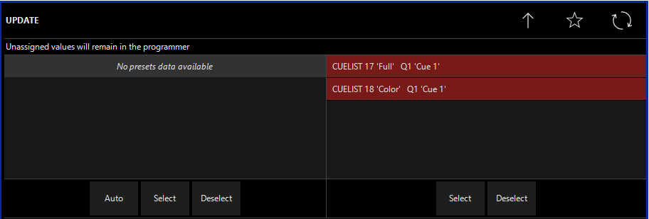
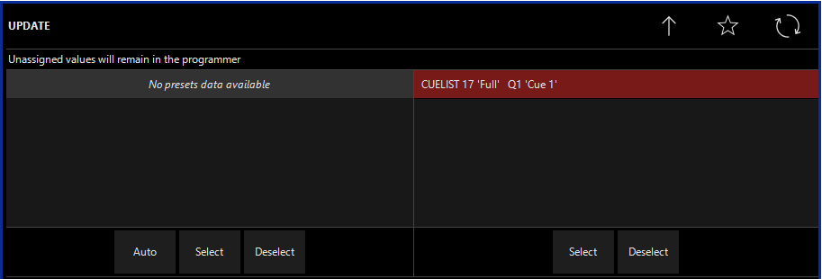
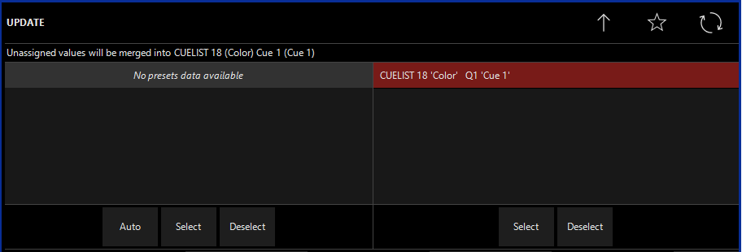
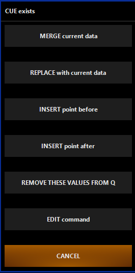
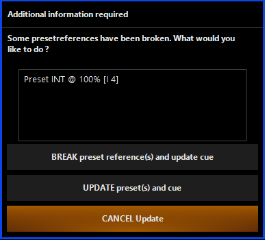

# Editieren und Updaten von Cuelists

Es wird häufig der Moment kommen das ihr eine bereits erstellte Cue verändern bzw updaten wollt. Entweder weil ihr was falsch gemacht habt oder weil ihr noch was hinzufügen wollt.

Es gibt hierbei verschieden Wege und um die soll es hier gehen.

### Update

Die erste Art ist die `UPDATE` Funktion. `UPDATE` kann einerseits viele Sachen vereinfachen, kann aber auch schnell viel kaputt machen. Und zugegebenermaßen gibt es einfachere Möglichkeiten, mit dem Nachteil das sie weniger praktisch sind.

#### Assigned vs. Unassigned

Bevor man sich um die Fähigkeiten von `UPDATE` zu nutze machen kann muss man den unterschied zwischen Unassigned Attributen und Assigend Attributen kennen.

Assigned Values sind Werte zwischen 0% und 100% (also non-NuLL). Dabei müssen die Werte nicht in einer Cue sein, sie gelten auch als Assigned wenn sie getracked werden.

Unassigned Values sind NuLL Werte, das heißt Onyx benutzt stattdessen die Default Values. 


#### Das Verhalten von `UPDATE`

Wenn die `UPDATE` benutzt wird passieren immer drei Sachen

1. es werden alle Attribute aus dem Programmer in aktive Cue geschrieben sofern diese Attribute schon in der Cuelist enthalten sind
2. Sollten die Attibute die schon in der Cue sind durch Presets erstellt sein wird das entsprechende Preset auch geupdated
3. Ist die Cuelsit der Cue selected werden zusätzlich zu `1` alle neuen Attribute in die Cue gespeichert. Ist keine Cuelist selected bzw die selectete Cuelist nicht akitv (hat einen `GO`omand bekommen) werden neue Attribute im Programmer gelassen.


Zum besseren Verständnis ein paar Beispiele:

Für das Beispiel benutzen wir 2 Cuelists mit jeweils einer Cue. Die erste Cuelist "Full" setzt den Intensity Wert auf 100%. Die zweite Cuelists "Color" setzt die Farbe auf Rot. (Beide Cues wurden ohne Presets recorded). 

Danach setzten wir die Fixtures der beiden Cuelists auf `INT` 50% und die Farbe Blau

##### Erstes Beispiel: Beide Cuelists sind aktiv, keine ist selected



(Der untere Teil des Update Screens ist absichtlich abgeschnitten, dieser wird später erklärt)

Da beide Cuelists aktiv sind gelten `Intensity` und `Color` als Assigend Values. Auf der Rechten Seite werden alle aktiven Cuelists aufgeführt und man kann auswählen welche bearbeitet werden soll. Sind beide Cues ausgewählt werden beide Cuelists geupdatet: Cue 1 "Full" hat den Wert 50%, Cue 1 "Color" hat den Wert Blau. Wählt man nur eine Cuelsit aus wird das entsprechende Attribut geupdated während das andere im Programmer bleibt.

##### Nur "Full" ist aktiv, keine ist selected



Das Verhalten hier ist ähnlich wie in Beispiel 1. Der Update Screen zeigt uns das nur eine Cuelist acktiv ist deswegen kann auch nur diese geupdated werden. Das Blau bleibt im Programmer "gespeichert"

##### "Full" ist inaktiv, "Color" ist aktiv und selected



Da "Full" inaktiv ist sind die Intensity Werte Unassigend. In den anderen Beispielen wurden die Unnasigend Values im Programmer gelassen. In diesem Fall ist die "Color" Cuelist aber auch selectet. Deswegen werden die Unassigned Values in dieser Cuelist gespeichert. 

Was mit den Unassigned Values Passiert kann man immer am Oberen Rand des Update Screens nachlesen

##### Und was passiert mit Presets? Und wichtiger, wie kann ich verhindern das Presests geupdated werden?

Auf der linken Seite des Update Screens kann man, wenn vorhanden, die benutzten Presets sehen. Genauso wie wir die Cuelists zum updaten auswählen, können wir auch auswählen ob und welche Presets geupdatet werden solle. Deselcten wir alle wird auch kein Preset geupdatet.


Die anderen Optionen der `UPDATE`  Funktionen werden wir hier nicht besprechen. Diese werden zu einem späteren Zeitpunkt erklärt, da diese zu diesem Zeitpunkt nicht wichtig sind. Wer sich spoilern will kann allerdings schonmal im Onyx Manual nachgucken. Viele der Optionen sind sich sowieso sehr ähnlich zu denen im Record Screen.


### Merge Replace und Remove

So stark die `UPDATE ` Funktion auch ist, möchte man alles in einer Cue verändern, oder auf ein paar der Funktionen verzichten weil die Veränderung nur klein ist gibt es bessere Alternativen: `RECORD CUE XX` . 

Bis jetzt haben wir den `RECORD` Befehl nur ohne weiter Attribute benutzt. Man kann aber die Werte aus dem Programmer aber auch in eine bestimme Cue recorden. Dafür auf dem Keypad `RECORD` `CUE` `*die nummer der Cue in die recorded werden soll*` .  Damit onyx weiß um welche Cuelist es sich handelt muss die entsprechende Cuelist selected werden.



Dieses Fenster wird dann auftauchen.

| Option                       | Erklährung                                                   |
| ---------------------------- | ------------------------------------------------------------ |
| `MERGE CURRENT DATA`         | Die neuen Werte werden mit den alten zusammengeführt. Ähnlich wie bei Presets |
| `REPLACE WITH CURRENT DATA`  | Alles alte wird gelöcht und nur die neuen Werte werden gespeichert. Ähnlich wie bei Presets |
| `INSERT POINT BEFORE`        | Die Werte aus dem Programmer werden in einer neuen Cue gespeichert. Diese Cue befindet sich VOR der Cue die im `Record` Befehl spezifiziert wurde. Die Cue trägt dann den Namen X.5 |
| `INSERT POINT AFTER`         | Ähnlich zu `INSERT POINT BEFORE`. Aber dieses mal wird die Cue HINTEr der Cue aus dem `RECORD` Befehl gespeichert. Die Cue trägt dann den Namen entweder den Namen X+1 oder X.5. |
| `REMOVE THESE VALUES FROM Q` | hat zwei Modi: Simple und Exact. Simple löscht den Attributstypen aus der Cue, Exact löscht nur dann den Attributstypen wenn der recordete Attributswert gleich dem gespeicherten Attributswert ist |
| `EDIT COMMAND`               | Ermöglicht es den Befehl nochmal zu verändern                |
| `CANCEL`                     | Beendet den Command komplett, die Attribute bleiben aber im Programmer |

Wichtig, es können auch mehrere Cues gleichzieitg bearbeitet werden. Der Systax Dafür ist:

```
Record | Cue | X | + | Cue | y ...
```

oder aber für viele Cues hintereinander:

```
Record | Cue | X | Thru | Cue | Y
```


### Edit

Mit dem `EDIT CUE X` Befehl werden alle Werte aus der spezifizierten Cue in den Programmer geladen. Einerseits kann man damit sehr einfach eine Cue updaten via dem `UPDATE` Knopf (dabei hat der Update Knopf eine andere Funktion als oben beschrieben, es gibt nicht den Update Screen etc) oder aber man kann die Attribute einer Cue (ggf leicht verändert) in einer neuen Cue recorden. Das macht die `EDIT` Funktion natürlich sehr nützlich. Außerdem ist die `EDIT` Funktion am einfachsten und mit ihr kann man am wenigsten kaputt machen.

Um sie zu benutzen einfach `EDIT CUE X` im Keypad drücken und schon werden alle Werte von Cue X der selecteten Cuelist in den Programmer geladen. Um diese Werte zu bearbeiten müssen dann nur noch die entsprechenden Fixtures ausgewählt werden. Der Rest läuft so ab wie man es kennt.

Ist man fertig mit seinen Änderungen, kann man diese entweder wie sonst auch mit `RECORD` in einer neue Cue recorden. Oder man drückt auf das blinkende `UPDATE` und die Werte aus dem Programmer werden in Cue X gespeichert. 

Wurde die Cue mit einem Preset erstellt kommt folgender Screen nach dem drücken von `UPDATE:`  

Sind Cues mit Presets erstellt worden haben diese eine Verbindung, die Presets sind referenced. Ändert man ein Attribut einer Cue das ursprünglicherweise mit Hilfe eines Presets recorded wurde kann man folgendes auswählen:

| Option             | Erklähurng                                                   |
| ------------------ | ------------------------------------------------------------ |
| `BREAK PRESET...`  | Die Verbindung zwischen Cue und Preset wird gebrochen.       |
| `UPDATE PRESET...` | Die Cue und das Preset wird geupdatet. Die Verbindung zwischen beiden bleibt bestehen |
| `CANCEL`           | Bricht den Command ab.                                       |

### Kopieren einer Cue

Auch wenn man  mit dem `EDIT` Command eine Cue von der einen Cuelist in eine andere Cuelist kopieren kann gibt es noch eine schnellere Möglichkeit ohne die Cue vorher in den Programmer zu laden. Allerdings muss man sich diese Art nicht unbedingt merken da `EDIT` das gleiche kann. 

Dazu benutzt man den `COPY` Command. Doch anstatt eine Kopie von einem Playback Button oder einem Preset zu machen benutzt man folgenden Syntax

```
Copy | Cue | X | @ |
```

nach dem `@` bestimmen wird durch klicken noch wohin die Cue kopiert werden soll. Drücken wir auf eine bereits bestehende Cuelist wird die Kopie von Cue X einfach als neue Cue hinten angefügt. Drücken wir stattdessen auf ein leeres Feld erstellt Onyx automatisch eine neue Cuelist des Typs Cuelist mit dem Default Namen. 

