#  Pixelmapping mit Dylos

Bei Dylos handelt es sich um eine Pixelmapping/Media Control Sevrver Software die bereits in Onyx integriert ist. Dylos erfüllt damit ähnliche Zwecke wie zum Beispiel Resolume mit dem Vorteil das man keine eignen Software braucht und man es via dem Lichtpult aus kontrollieren kann.

Dylos kommt mit dem sogenannten Factory Content, eine von Obsidian Control Systems bereitgestellte Datei mit verschiedenen Medien: Bilder, Videos etc. Man kann natürlich auch  seinen eigenen Content importieren und diesen benutzen.

### Allgemeines 

Dylos funktioniert in sogenannten `Zones`. Jede `Zone` ist dabei sein eigner Media Server der unabhängig Content abspielen kann. 

*Im FREE Mode sind 2 Zones verfügbar, über allen weiteren wird eine Demo Watermark dargestellt*

Dylos Content lässt sich über die gleichen Parameter steuern wie auch normale Fixtures, das heißt Dylos Effekte können einfach so in die Show bzw. Cuelisten eingebracht werden. Gleichzeitig lässt sich Dylos Content nicht nur auf Pixelwände bzw Bidlschirme darstellen sondern auch auf ganz normale Scheinwerfer um effektvolle FarbFX zu erstellen. Dabei werden die (Farb)Informationen automatisch auf die Fixtures übertragen. 

### Quickstart

Das hier gezeigte soll nur eine grundlegende Idee vermitteln wie man Dylos benutzt. Im laufe der Zeit wird das ganze etwas erweitert werden. Aber auch nur wenn ich die Zeit dazu finde.

Es gibt 3 Schritte um Dylos Content abspielen zu können:

1. Content importieren
2. `Zones` erstellen, positionieren und gewünschten Content auswählen
3. Die in Dylos eingebauten Effekte benutzen

*Zu Demo zwecken werden nur die Default Views gezeigt, es macht allerdings Sinn (wie auch sonst) sich eigen zue erstellen*

### Content

#### Factory Content

Um den Factory Content zu Importieren:

```
>> Onyx Menu >> Load7Save >> Settings >> Import Dylos Content >> (Factory Content auswählen und warten )
```

wenn alles erfolgreich Importiert wurde auf Library drücken. Diese sollte dann so aussehen:

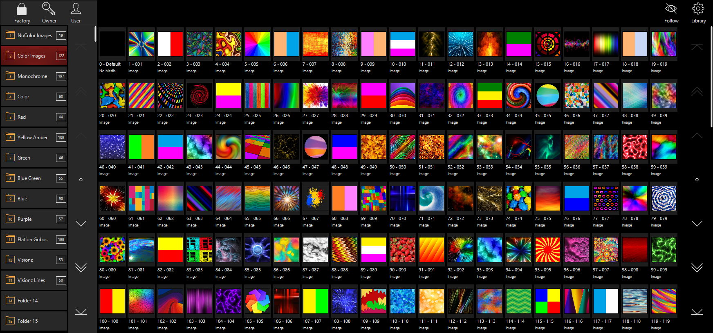

*Sollten bei manchen Thumbnails ein orangener Warnhinweis sein wurde nicht der komplette Content importiert. Das liegt am ehesten daran das nicht genügend Platz auf der Festplatte war.*

Auf der linken Seite befinden sich bereits benannte Ordner gefüllt mit den entsprechenden Videos/Bildern

#### User Content

Onyx unterscheidet bei User Content zwischen Owner und User Content. Owner Content macht nur dann Sinn wenn man ein NX Wing, eine konsole oder einen Lizens USB Stick hat. Wie das beim NX-Touch aussieht, gute Frage, werde ich noch herausfinden.

Für Owner Content braucht man den Owner Pin, sonst verhält er sich identisch zu User Content.

Um User/Owner Content zu importieren von Factory auf user Content wechseln,

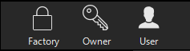

dann auf einen Ordner mit der rechtne Maustaste drücken und auf Import Content File(s) drücken

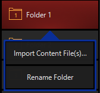

dann können entweder einzelne oder mehrere Bilder/Videos ausgewählt werden. Je nach dem wieviel content ausgewählt wurde kann der Import etwas dauern. Bitte nicht während des Import Onyx schließen, Dylos ist fragil, sowas kann eine neu-Installation bedeuten. 

Onyx unterstützt alle gängigen Video und Bild Formate. Bei beidem gilt natürlich je höher die Qualität desto besser.

Text muss nicht als eigene txt Datei importier werden, diese können auch direkt in Onyx selber erstellt werden.

#### Save with Content

Damit Onyx das Showfile auch mit dem entsprechenden content speichert nach dem Importieren einmal das Showile mit dem Dylos Content zu speichern. Dafür:

```
>> Onyx Symbol >> Save With Content
```

### Zones

Um eine `Zone` zu erstellen erst in einen View wechseln der den 2D-Plan beinhaltet. Dann den Edit Mode aktivieren und unter `ADD` den Reiter `Zone Fixtures` anklicken. Sollte Dylos für dieses Showfile noch nicht aktiviert worden sein wird sich dort ein Knopf mit der Aufschrift : "Enable DyLOS Support" befinden. Auf diesen drücken dann sieht das Add Fenster so aus:

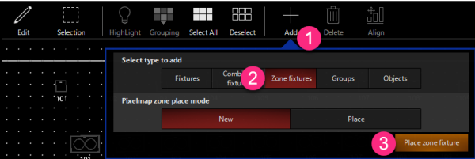

Dort gibt es die Möglichkeit entweder eine Neue Zone Fixture zu erstellen oder einebereits erstellte zu platzieren. (Zone Fixtures besitzen genauso wie reguläre Fixtures eine ID, diese kann man im Patch Window finden und ggf. auch ändern.)

Danach auf `Place zone fixture` drücken und im 2D-Plan plazieren. mit den Pfeilen kann die `Zone` entsprechend angepasst werden. Alle Fixtures in der `Zone` werden den Content in der `Zone` abspielen.

#### Content auswählen

Dafür in den View `Zone Composer` wechseln. 

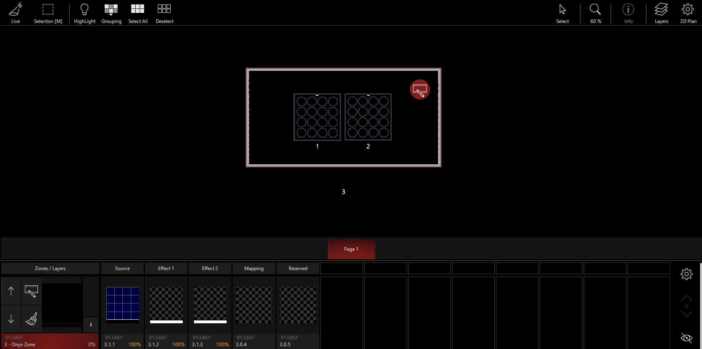

*Für die Demo benutze ich zwei ADJ Dotz Matrix im 48Channel Mode.*

Unten von links nach rechts:

| Bild                | Funktion                                                     |
| ------------------- | ------------------------------------------------------------ |
| 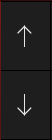 | Um zwischen den einzelnen Zones zu wechseln. Alternativ kann man die Zone auch im 2D-plan anklicken. |
| 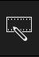 | Um den Source Content auszuwählen.                           |
| 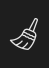 | Um den Content wieder aus der Zone zu entfernen              |
| 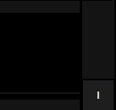 | Auf der linken Seite wird der dargestellte Content angezeigt, der Fader mit dem `I` ist der Intensity Fader für Dylos. |
| 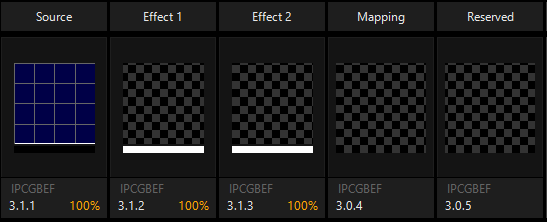 | Die einzelnen "Layers"                                       |

Dylos arbeitet mit dem Source Content (dieser wurde importiert) und bietet dann die Möglichkeit diesen mit Effects zu verändern. Am ehesten kann man sich das wie Layers in Photoshop vorstellen. jede Layer legt sich über die Layer davor. Mapping und Reserved haben zur Zeit keine Funktion.

Um nun Content darzustellen muss erst der Source Content ausgewählt werden. Dazu auf  drücken. Dann öffnet sich folgendes Fenster:

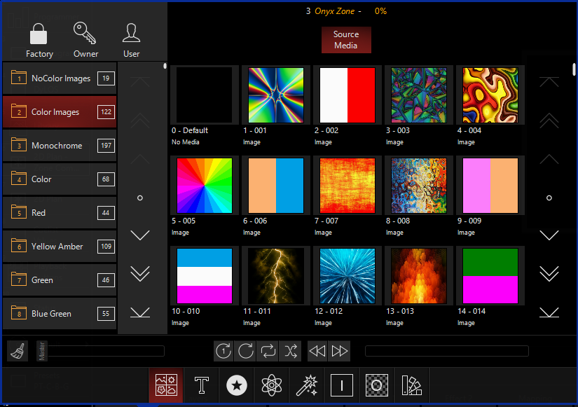

Dort kann eine Datei ausgewählt werden. Zusätzlich kann die Geschwindigkeit eingestellt werden (sofern es sich um ein Video handelt (Vorsicht, je nach Video bzw. der Framerate des Videos kann es bei zu geringen Geschwindigkeiten schnell zu ruckeligen Videos kommen)). Außerdem kann man die Richtung etc. einstellen. Über die unteren Reiter gelangt man zum Effect Content. 

Weiter Einstellungen lassen sich über das CV einstellen. Darunter fallen verschiedene Zoom-Einstellungen sowie die Möglichkeit den Content zu rotieren etc. Außerdem kann genauso wie bei Fixture FX erstellen. Teilweise ändern sich die Möglichkeiten im CV je nachdem ob man Source Layer oder die Effect Layer ausgewählt hat. Welche ausgewählt ist sieht man wie immer daran welche Rot umrandet ist.

Über den vorhin bereits gezeigten Intensity Fader lässt sich die Intensity des Dylos Content regeln. das ermöglicht mischen von normalen Onyx Attributen und den Dylos Attributen. 

Wichtig, der Dylos Int Fader regelt nicht die Intensity der eigentlichen Fixtures. Damit Content auch angezeigt werden kann muss der Int Value der Fixtures auch noch erhöht werden kann. 

Ist alles richtig kann man den Dylos Effekt als ganz normale Cue speichern und auch abspielen

[Gif](Pics/16_Dylos.gif)

