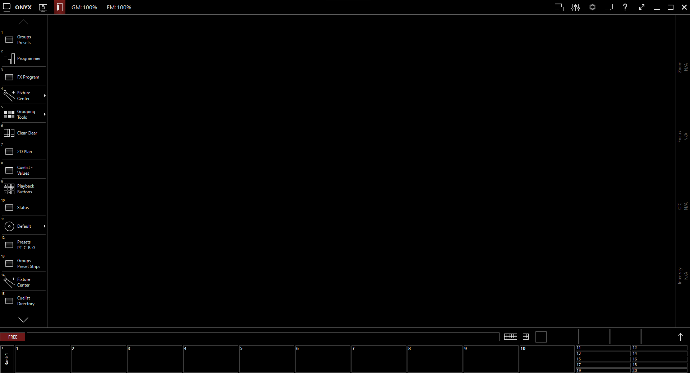
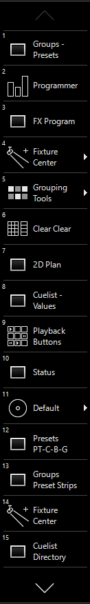
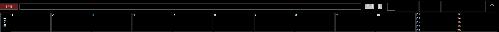
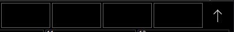

# Interface

Nach dem erstellen einer neune Schow sieht Onyx so aus:

Erklährungen der einzelnen Sachen (von Links nach Rechts)

Onyx Symbol: Öffnet den General Tab, darin sind:
* Show Settings und patchen von Scheinwerferfern
* Open & Export 
* Tools
* Fixture Control

Monitor Icon: Workspaces editieren und erstellen
Show/Hide Button: Um Side Bar zu verstecken
GM und FM: Grandmaster und Flashmaster

* Grandmaster, Master fader 
* Flashmaster, Fader für flashbuttons

Leerer Streifen zeigt zur Zeit ausgewählte Cuelist

Bei den restlichen Knöpfen ist nur das Fragezeichen relevant. Dies öffnet die eingebaute Bedienungsanleitung. Wenn aktiviert werden für alle angeklickten Dinge eine Erklärung dargestellt.

Sidebar genannt,
View auswahl. Alle (auch selber erstellte Views) lassen sich links finden und können jederzeit editiert werden. Views mit einem Pfeil hinter dem Namen lassen klappen sich als Overlay aus.

 

* Das rote "FREE" Symbol: Die zur Zeit ausgewählte Lizenz.

* Command Line: Dort wird die zur zeit ausgeführte Aktion in Worten dargestellt

* On Screen Tastaur

* Command Pad. Alle Funktionen werden darüber durch anklicken ausgewählt. Für die meisten Funktionen gibt es auch **Shortcuts**.

* 

  * Die vier Quadrate repräsentiern 4 Encoder. 

  * Pfeil: öffnet Channel Visualization. GUI um Attribute zu Scheinwerferfern hinzuzufügen. 

* Ganz Unten ist die Fader Bank. Die Ersten 10 pro Bank werden direkt dargestellt, auf Fader 11-20 kann man durchdoppelklicken rechts daneben zugreifen.
Insgesamt gibt es 500 Banks

>Keyboard Shortcuts findet man im Ordner "Cheat Sheets"
