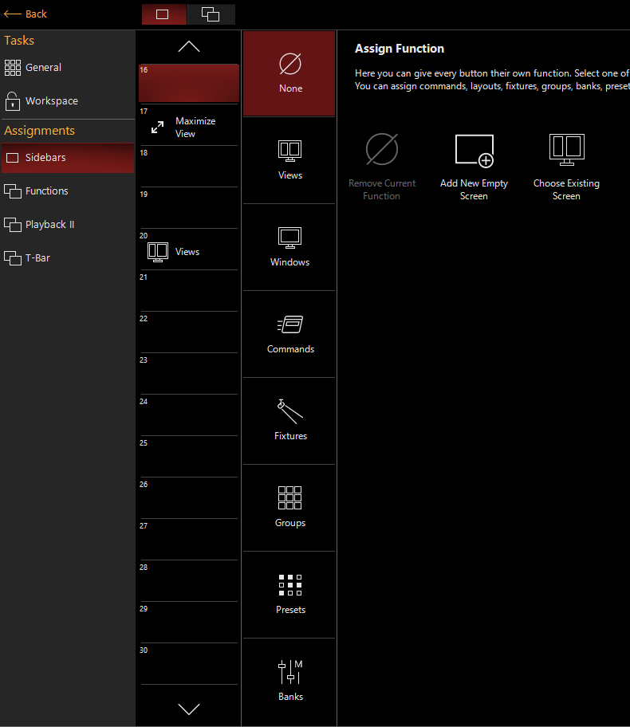
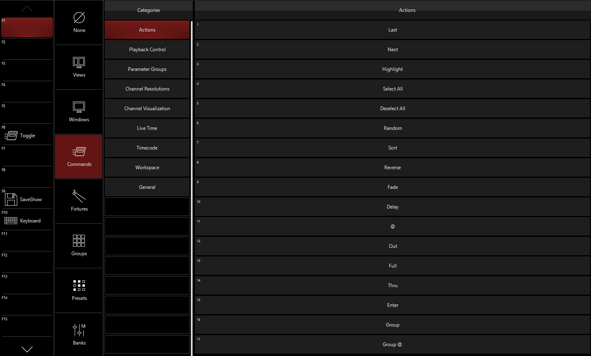

# Views/Windows

Onyx besteht aus Worksapces, Views und Windows. In jedem wokrspace befinden sich Windows und Views. 

Selber erstellete Views bestehen aus Windows die man frei anordnen kann.

## Views und Windows

Weg um eigene Views zu erstellen/editieren

    >> Monitor Icon >> "Unlock Workspace"

um neuen View zu erstellen, auf freies Feld in der Sidebar drücken, um bestehenden View zu editiern auf den entsprechenden view rechtklick drücken:

    >> "None" >> "Add New Empty Screen"

* "New View" erstellt einen neuen View
* "Safe View" speichert ausgewählten View 
* "Layouts" Templates für die Anordnung von Windows
* "Resize Window" Windows vergrößern/verkleinern
* "Swap" tauscht die Plätze von zwei Windows innerhalb des ausgewählten Views
* "Delete Window" löscht ein Window
* "Exit Edit" verlässt den Editor
* Plus zeichen: Auswahl an Views
* "Delete Window"
* Horizontale bzw Vertikale Trennung ("Layouts")

Manche Views haben oben recht ein Zahnrad für Einstellungen, für Größe, Farben etc.

Nachdem View erstelle wurde speichern

    >> "Safe View" >> (Name vergeben, Rest auf Internal Right lassen) >> OK

Auch wenn stock Views von Onyx nutzbar sind, eigene Views mit verschiedenen Funktionen die man parallel braucht erhöhen Workflow

Beispiel

Alle wichtigen Fenster zum erstellen von Cuelisten wurden zu einen View hinzugefügt

## Workspaces

Verschieden Views können zu "Ordnern" zusammengefasst werden, diese werden Wokspaces genannt. Onyx kommt standartmäßig mit folgenden:
* Compose
* Playback
* DJ
* Examples

Um einen bestehenden Workspace zu betreten:

    >> "Monitor Icon" >> entsprechenden Workspace anklicken

Um einen neuen Workspace zu erstellen:

    >> "Monitor Icon" >> Unlock Workspaces >> Manage Workspaces >> Add

Unter *Manage Workspaces* können Einstellungen zu bestehenden Workspaces getroffen werden.

Ob man Workspaces benutzen will bleibt jedem selber Überlassen

## Function Keys

Function Keys findet man eig nur auf den richtigen Konsolen. Man kann aber auch die F-Tasten benutzen.

Um die Funktion der F-Tasten bzw. der Function Keys einzustellen:

    >> "Monitor Icon" >> "Onyx Menu" >> Funtions

Man kann alle möglichen Commands, Views, Gruppen etc zuweisen. Einfach Ausprobieren was und ob man das braucht.

Nach dem Editieren von Views etc. den Workspace wieder locken

    >> "Monitor Icon" >> Lock Workspace

