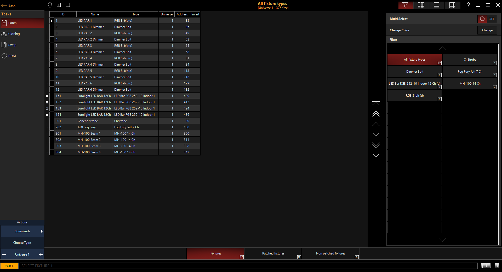
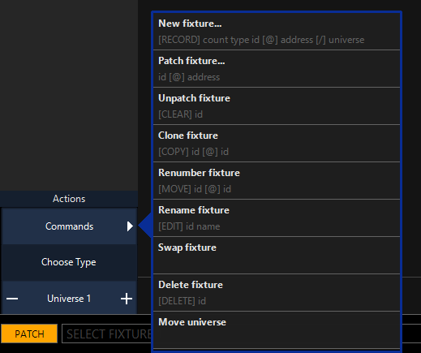
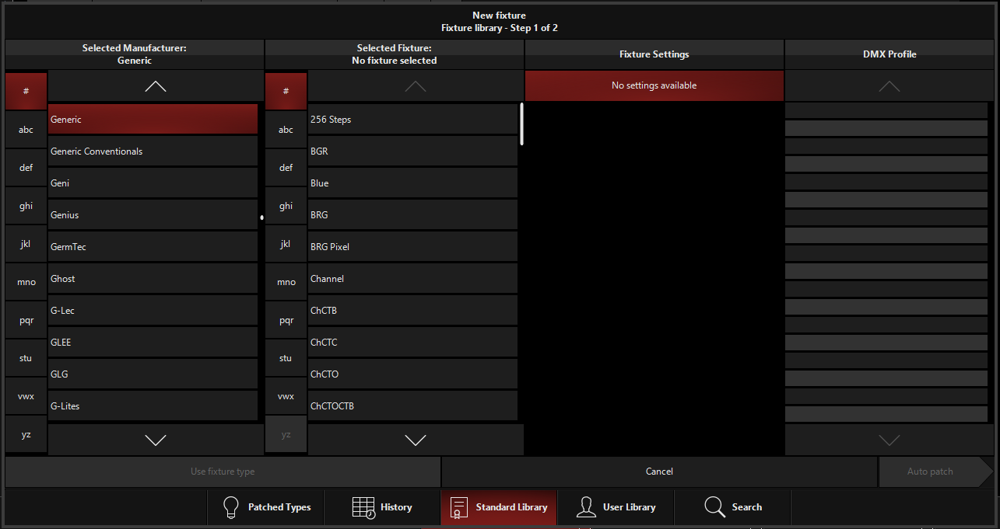
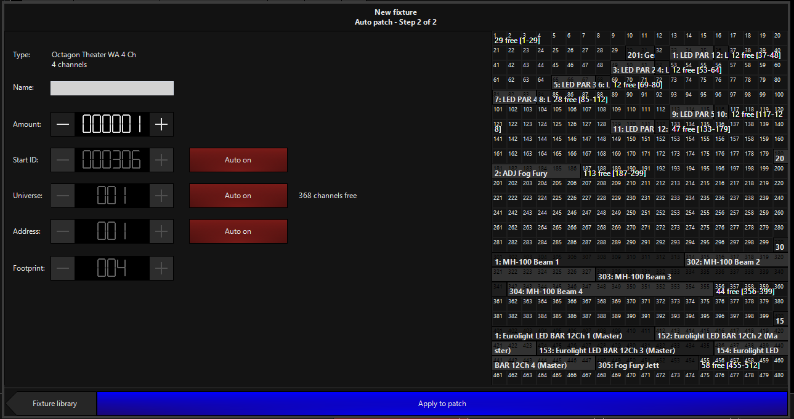

# Die erste Show

## Patching
    >> Onyx Menu >> Patch

Links stehen verschieden Optionen, für den Anfang reicht Patch
In der Mitte stehen bereits gepatchte Scheinwerfer. Rechts kann man nach gepatchen Fixtures filtern und Optionen ändern.

Das wichtigste: das Actions Menu

Unter *Commands* findet man alle Commands die mit dem Patchen bzw editierne von Fixtures zu tun haben. 
Alle funktionieren ungefähr nach dem gleichen Prinzip und wie sie genau funktionierne kann man am CommandLine Befehl sehen.

Beispielshafterweise nur *New Fixture* 

    >> Commands >> New fixture...

allternativ

    >> Choose Type

Danach öffnet sich folgendes Fenster:

* "selected Manufacturer*: alle Möglichen Hersteller, außerdem "Generic" für LED PARs, Fogs etc bzw "Generc Conventionals" für Dimmer, Blinder etc
* "Selected Fixture": Modell
* "Fixture Settings": verschiedene Einstellungen wie die anzahl an Channels (Stairvill MH-100 haben Wahl zwischen 9 und 14 Channel Mode)
* "DMX Profile": Die Reihenfolge der Funktionen der ausgewählten Fixture

###### (manchmal gibt es bei "Fixture Settings" auch die Option Virtueller Dimmer: 
###### manche meist LED-Pars bestehen haben keinen dedizierten Dimmer Channel. Damit die Dimmer Funktionen bzw Dimmer FX genutzt werdne können gibt es den virtuellen Dimmer. Den eig immer aktivieren, schaden tut er fast nie)

 

Untere Leiste

* "Patched Types": bereits gepatche Fixtures zum nochmal patchen
* "History": alle jemals aufn diesem PC/Konsole je gepatchden Fixtures
* "Sandart Library": die standart Bibliothek an Fixture Porfiles
* "User Library": alle selber erstelleten bzw importieren Fixture Profiles 
* "Search": um nach bestimmten Fixtures zu suchen (ist relativ broken)

Nachdem Fixture gewählt ist 

    >> Auto Patch

dann öffnet sich folgendes Fenster:

* "Type": gerade ausgewählte Fixture
* "Name": Name zum Wiedererkennen
* "Amount": die anzahl an Fixtures die man gleichzeitig patchen will
* "Sart ID": Um Platz zu sparen zeight Onyx manchaml nur die ID an. Entweder man überlegt sich selber ein ID System (unter Cheat Sheet ist ein Vorschlag) oder man lässt es auf Auto 
* "Universe": das Universum, unter der FREE Lizenz sind nur 4 verfügbar, ENTTEC unterstüzt aber nur eins
* "Adress": die DMX start Adresse
* "Footprint: legt die Anzahl an freien Channels zwischen mehreren Fixtures fest (am besten sieht man das rechts)

auf der rechten Seite sieht man eine Visualation des ausgewählten DMX Universums und den Footprint der Fixtures die man patchen möchte. Ist der Footprint grün ist alles ok, ist er Rot sind nicht genügend Adressen am Stück frei.

Danach auf 

    >> "Apply to Patch"

drücken. Dann sind die Fixtures gepatched
#

>BUG: Manchmal hat Onyx ein Lizenz Bug. Dann ist hinter jeder Fixture ein kleines Schloss und am Rand steht " You exceeded the amount of supportet universes. Chech your license or adjust the patch. Das einfachste ist dann Onyx neu zu starten. 
>Dieser Bug tritt nur beim starten auf, nicht wärend einer Show