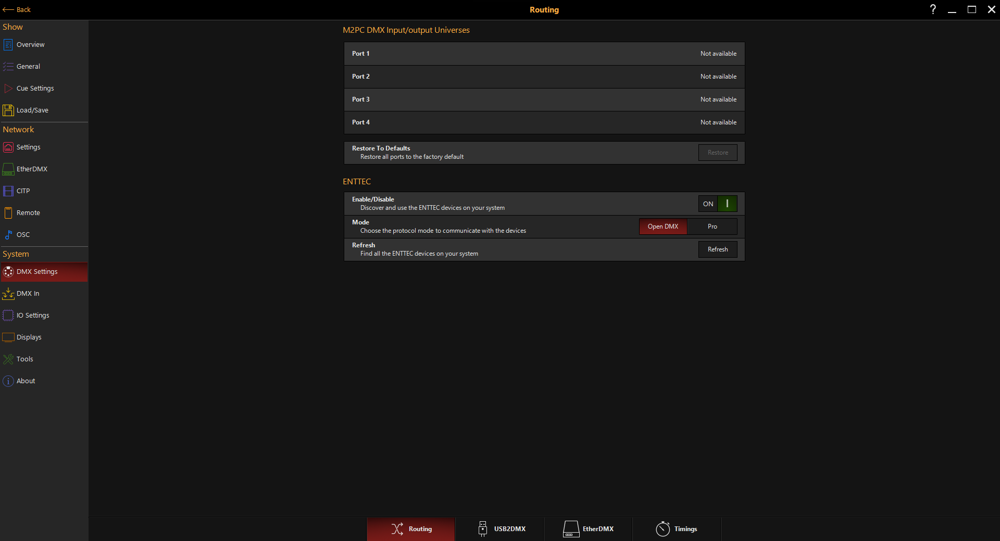
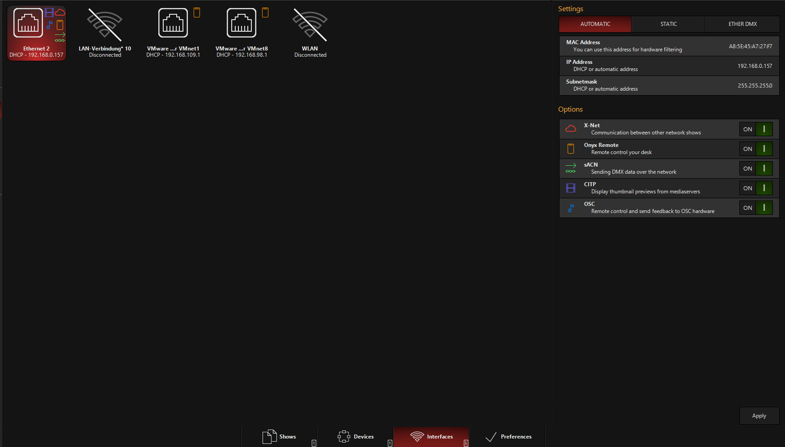
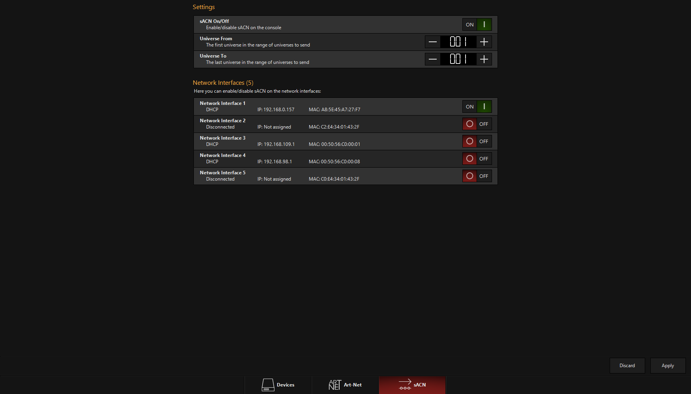
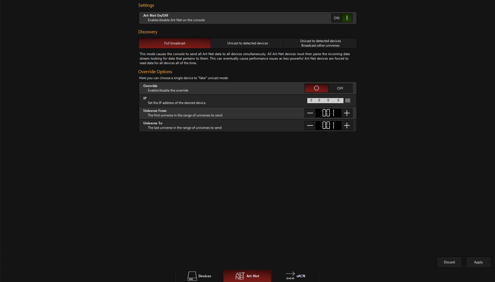

# DMX Output
## USB DMX Geräte 
###### (das von Pierre-Luca)

    >> Onyx Menu >> Menu >> DMX Settings

    Enable/Disable: ON
    Mode: Open DMX

Unter dem Reiter "USB2DMX" findet man imNormalfall das verbundene Enttec USB Gerät.

Wenn nicht folgende Möglichkeiten:

* Refresh mehrmals drücken
* Enttec Gerät neu verbinden
* Onyx neustarten

## Netzwerk DMX Geräte (sACN & ArtNet)

##### unterschied zwischen sACN und ArtNet ist online erklährt

    >> Onyx Menu >> Menu >> Settings (Network Tab) >> Interfaces (im unteren Menu)

* Interface auswählen (normalerweise Ethernet X)
* Im Settings Tab werden einstellungen für das Interface getroffen, für sACN und ArtNet auf Ether DMX stellen
* Im options tab können Funktionen ein und ausgestellt werden. Für sACN ist sACN zwingen nötig. Die anderen Einstellungen kann man allerdings auch auf "ON" stellen (Die Funktionen werden später erklährt)

dann 

    >> Apply

### Für sACN:

    >> EtherDMX >> sACN

Im Tab sACN:

sACN: ON

Universe From: *das erste Universum das ausgegeben werden soll, meisten 1*

Universe To: *das letzte Universum das ausgegeben werden soll, meisten auch 1*

Im Tab Network Interfaces für das vorher ausgewählte Interface sACN anschalten.

danach

    >> Apply

### Für ArtNet:

    >> EtherDMX >> ArtNet

Im Tab ArtNet:

ArtNet: ON

Im Tab Discovery

* Full broadcast: alle Universen werden zu allen ArtNet Geräten geschickt, kann zu Performace Problemen bei mehreren schlechten Art net Geräten führen. 
* Unicast to detected Devices: DMX wird nur an erkannte ArtNet geräte geschickt. Außerdem ist die Konsole dafür verantwortlich das jede ArtNet nur die DMX Inforamtionen bekommt die es benötigt
* Unicast to detected Devices Broadcast other Universes: Die Mischung aus beiden, DMX wird an erkannte Geräte geschickt, der Rest an alle.

Im Normalfall wird Unicast to detected Devices empfohlen. Allerdings wird nicht jedes ArtNet Gerät von Onyx als solches erkannt. Wenn also Unicast to detected Devices nichts bringt und sonts alle Eisntellungen richtig sind auf Full Broadcast wechseln.

Die Override Einstellungen können erstmal ignoriert werden. Kurzgesagt, wenn eingestellt kann man Unicast damit faken sollte das Art-Net Gerät kein auto-discovery unterstützen

Wenn das ArtNet Gerät AutoDiscovery Unterstützt findet man dieses unter Devices. Dort können unteranderem die Universen die an das Gerät gesendet werden ausgewählt werden. benutzt man nur ein ArtNet Gerät sind solche Einstelungen aber nicht nötig und werden hier nicht behandelt.

Unterstützt das Gerät nicht AutoDiscovery müssen die passenden Einstellungen am Gerät selber getroffen werden. (Im Falle von Enttec in der Node Managment Utility).

Sind alle Einstellungen getroffen 

    >> Apply

>Es ist unbekannt ob Enttec Open DMX Auto Discovery unterstüzt (oder am worken ist). Erklärung zu den richtigen NMU Einstellungen folgen.