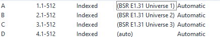
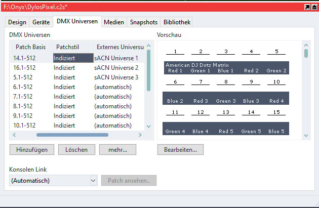

# DMX Output
## USB DMX Geräte 
###### (Vers 4.2.xxxx)

    >> Onyx Menu >> Menu >> DMX Settings


    Enable/Disable: ON
    Mode: Open DMX

Unter dem Reiter "USB2DMX" findet man imNormalfall das verbundene Enttec USB Gerät.

Wenn nicht folgende Möglichkeiten:

* Refresh mehrmals drücken
* Enttec Gerät neu verbinden
* Onyx neustarten


## Netzwerk DMX Geräte (sACN & ArtNet)

Diese Anleitung gilt nur für Version 4.4.1193. In der neuen Beta wurde das EtherDMX Fenster überarbeitet. Sobald ein fertiger Release da ist werde ich mich darum kümmern das zu überarbeiten.

    >> Onyx Menu >> Menu >> Settings (Network Tab) >> Interfaces (im unteren Menu)


* Interface auswählen (normalerweise Ethernet X)
* Im Settings Tab werden einstellungen für das Interface getroffen, für sACN und ArtNet auf Ether DMX stellen
* Im options tab können Funktionen ein und ausgestellt werden. Für sACN ist sACN zwingen nötig. Die anderen Einstellungen kann man allerdings auch auf "ON" stellen (Die Funktionen werden später erklährt)

dann 

    >> Apply


### Für sACN:

    >> EtherDMX >> sACN


Im Tab sACN:

sACN: ON

Universe From: *das erste Universum das ausgegeben werden soll, meisten 1*

Universe To: *das letzte Universum das ausgegeben werden soll, meisten auch 1*

Im Tab Network Interfaces für das vorher ausgewählte Interface sACN anschalten.

danach

    >> Apply


### Für ArtNet:

    >> EtherDMX >> ArtNet


Im Tab ArtNet:

ArtNet: ON

Im Tab Discovery

* Full broadcast: alle Universen werden zu allen ArtNet Geräten geschickt, kann zu Performace Problemen bei mehreren schlechten Art net Geräten führen. 
* Unicast to detected Devices: DMX wird nur an erkannte ArtNet geräte geschickt. Außerdem ist die Konsole dafür verantwortlich das jede ArtNet nur die DMX Inforamtionen bekommt die es benötigt
* Unicast to detected Devices Broadcast other Universes: Die Mischung aus beiden, DMX wird an erkannte Geräte geschickt, der Rest an alle.

Im Normalfall wird Unicast to detected Devices empfohlen. Allerdings wird nicht jedes ArtNet Gerät von Onyx als solches erkannt. Wenn also Unicast to detected Devices nichts bringt und sonts alle Eisntellungen richtig sind auf Full Broadcast wechseln.

Die Override Einstellungen können erstmal ignoriert werden. Kurzgesagt, wenn eingestellt kann man Unicast damit faken sollte das Art-Net Gerät kein auto-discovery unterstützen

Wenn das ArtNet Gerät AutoDiscovery Unterstützt findet man dieses unter Devices. Dort können unteranderem die Universen die an das Gerät gesendet werden ausgewählt werden. benutzt man nur ein ArtNet Gerät sind solche Einstelungen aber nicht nötig und werden hier nicht behandelt.

Unterstützt das Gerät nicht AutoDiscovery müssen die passenden Einstellungen am Gerät selber getroffen werden. (Im Falle von Enttec in der Node Managment Utility).


Sind alle Einstellungen getroffen 

    >> Apply

### Onyx mit Capture

Capture benutzt sACN um den OOutput von onyx darzustellen. Das heißt das man sACN für alle inm Showfile benutzen Universen anschalten muss. Onyx erlaubt in der FREE Lizenz den Output von bis zu 4 Universen. Danach in Capture kontrolieren ob er diese Universen auch findet. Für die Capture Demo: 

```
>> Window >> Universes
```



hat alles funktioniert sihet das ganze so aus.

Für Capture 2020 ist das ganze ein wenig anders:

```
>> "Delta Ansicht" >> DMX Universen >> für die einzelnen Universen das richtige sACN Universum auswählen
```



Mnachmal erkennt Capture nicht direkt alle Univesen. Es kann aber trotzdem sein das es funktioniert. Deswegen die anderen Universen auf `automatisch` lassen. Wie man capture sonst benutzt reden wir später noch, für die emiste Zeit reicht das Demo File.

### NMU für Enttec

NMU oder Node Managment Utility ist die Software um Enttec Art-Net Geräte zu konfigurieren, Auch wenn es nicht dirket was mit Onyx zu tun hat macht es Sinn sich damit vertrautm zu machen für den Fall das etwas nicht funktioniert.

NMU bietet die Möglichkeit den Namen, die IP Adresse, Subnet und Universe und die Refresh Rate zu bestimmen. Außerdem kann man den Mode von DMX Input zu Output ändern. 