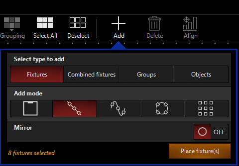

# SetUp und benutzen des 2D Plans

Der 2D Plan ist Onyx eingebauter Visualizer. Im Gegensazt zu Capture und MA3D allerdings nur in 2D. Ist auch kaum als Alternative anzusehen aber für Grundfunktionen und als Kontrolle Funktioniert es. 
##### eine Erklärung wie man MA3D mit Onyx verbindet kommt später

    >> 2D Plan (in der Sidebar)

Links Oben:
* Live/Edit: um vom Live Modus in den Edit Modus zu wechseln, es wird immer nur der aktuelle Modus angezeigt
* Selection: Die Art der Auswahl mit der Maus (dem Finger) zu ändern.
* HighLight: bei allen ausgewählten Scheinwerfern wird der Dimmer auf 100% gesetzt. Dies übertrifft alle Einstellungen im Programmer und alle Cues. Zusätzlich wird dies auch neben der CommandLine gezeigt 
  * 
* Grouping: verschiedene Möglichkeiten bereits selektirete Fixtures zu gruppieren
* SelectAll/DeselectAll: alles auswählen/abwählen

Rechts Oben
* Select/Pan: wechsel zwischen Fixtures auswählen und 2D Plan verschieben
* Zoom
* Layers: Layers wie in Photoshop für kompliezierte 2D Pläne
* Einstellungen

Unten
* Page x: auswahl zwischen verschieden Seiten

Der untere Teil des 2D Plans gehört zu den DyLOS Funktionen, können für den Anfang also ignoriert werden. Wer möchte kann dieses Window auch löschen

## Im Edit Mode

neu Im Edit Mode dazugekommen:
* Add: Um bereits ausgewählte Fixtures hinzuzufügen
* Delete: Um im 2D Plan ausgewählte Fixtures aus dem 2D Plan zu löschen
* Align: verschiedene Möglichkeiten ausgewählte Fixtures auf eine Vertikale/Horizontale Ebene zu bringen
* Options: verschiedene Optionen die sich ändern je nach dem welche Fixture was ausgewählt hat. 

Unten:
* Add: Um neue Pages hinzuzufügen
* "Pfeil Links"&"Pfeil Rechts": reihenfolge der Pages ändern
* Rename/Copy/Delete: Bearbeitung von ausgewählter Page
### Eine Fixture bzw mehrere zum 2D Plan hinzufügen:
1. In den Edit Modus wechseln

2. eine bzw mehrere Fixturres auswählen. (am einfachsten über das Pop-Up Fixture Center auf der Sidebar). (Als Beispiel wurden 8 Fixtures ausgewählt)
3. Auf Add drücken: 
   * 
   * Select Type to add:
     * Fixture: hinzufügne von einfachen Fixtures
     * Combined Fixture: Fixture wie LED-Bars hinzufügen (optional)
     * Groups: Einen Shortcut, um eine ganze Gruppe auszuwählen, hinzufügen 
     * Objects: geometrische Formen hinzufügen um eine Sage nachzubilden
    * Add Mode
      * einzelne Fixture
      * Alle Fixtures in einer Linie
      * Fixturs auf mit der Maus gemahlter Linie hinzufügen
      * Fixtures als kreis hinzufügen
      * Fixtures als Grid hinzufügen
    * Mirror 
      * wenn auf On, die Möglichkeit Fixtures entlang der vertikale, der Horizontale oder eine selber gemalten Linie zu spiegeln
1. wenn Auswahl getroffen wurde auf Place Fixture(s) drücken und hinzufügen
2. Danach wieder in den Live Modus wechseln 

Das benutzen des 2D Plans ist komplett Optional. Am Anfang hilft die graphische Visualisation aber für komplexe Bewegungen braucht man 3D Software wie Capture 

