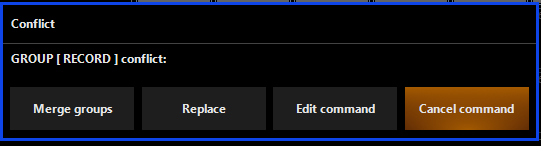

# Groups und Presets
## Fixture Center
Im Fixture Center können einzelne Fixtures, automatische Gruppen oder selbsterstellte Gruppen jederzeit ausgewähl werden

* Groups: selbsterstellte Groups werden dargestellt
* Masks: Teile einer Gruppe werden ausgewält. Zwischen den einzelnen Teilen aknn mit den `Last` und `Next` tasten auf dem Keypad gewechselt werden
* Auto: von Onyx automatsich erstellte Gruppen nach Fixture Typ
* Fixtures: Alle gepatchten Fixtures
* Selected: alle zur Zeit ausgewählten Fixtures

## Groups 
Groups vereinfachen das Auswählen von mehreren Fixtures. 
Wichtig: eine Fixture kann mehreren Groups zugeordnet werden.

    >> 2D Plan oder Fixture Center öffnen >> Fixtures auswählen >> Fixture center einklappen >> Record >> Auf freies Group klicken >> Name vergeben >> Enter

Fixture Groups können entweder direkt im Fixture Center (im Groups Tab) recorded werden oder im Groups-Presets View.
>Die globale Farbe für Group Windows ist blau

(Die Einstellungen am oberen Rand des Groups- Fenster sind die funktional gleich zu denen im 2D-Plan)

## Presets
Um das erstellen von Cuelisten zu beschleunigen erstellt man zuerst Presets. Presets können Fixture, Timing, und Delay Attribute speichern. Am häufigsten (und für den Anfang am relevantesten) sind aber Presets mit Fixture Attribute. 

Es gibt verschiedene Preset Typen:
* Intensity (Weiß)
* Pan Tilt (Rot)
* Color (Grau)
* Gobo (Grün)
* Beam (Gelb)
* Beam Fx (Blau)
* Framing (Lila)

 für unsere Fixtures sind nur Intensity, PanTilt und Color wichtig. Jedes Preset kann nur die Informationen passend zum Preset speichern. Ein Intensity Preset kann keine Pan Tilt Attribute beinhalten. Presets sollten immer für alle Gruppen gleichzeitig erstellt werden (sofern Sinnvoll). 

Intensity Preset erstellen (für die andere typen gleich):

    >> eine oder mehrere Groups auswählen >> Channel Visualization öffnen >> Links Intensity auswählen >> Output: DMX Wert (in %) festlegen >> Record >> Auf freies Feld im Intensity Tab klicken >> Name vergeben >> Enter

eine erfolgreich erstellte Gruppe sieht so aus:

verschiedene Gruppen und Presets:

Wie man bei den Color Presets sieht kann man Presets auch Color coden. Dafür auf das Zahnrad rechts neben den Presets drücken. Damit die Farben auch gespeichert werden, immer dran denken auch den View erneut zu speichern.

## Gruppen und Presets benutzen:

    >> Group(s) auswählen >> passende Presets auswählen >> die im Preset recordeden Presets wurden auf Die Groups(s) angewendet

Ist ein Preset ausgegraut enthält es nicht anwendbare Attribute die ausgewählte Gruppe. Entweder weil es sie nicht gibt oder weil sie nicht recorded wurden.

Das Preset BAR Strobe 100 (setzt den Strobe Effect von LEDBars auf 100%) lässt sich offensichtlich nicht auf Stufenlinsen anwenden. 

## Wichtig! Attribute aus Presets werden nur auf die ausgewählten Groups angewendet. Auch wenn das Preset für viel mehr Groups erstellt wurde. 

## Wichitg! Wenn man ein Preset in verschieden Cues benutzt und danach das Preset updated können die Cues die dieses Preset beinhalten auch automatisch geupdated werden.

## Groups und Presets bearbeiten

Mit den Funktionen `Copy`, `Move` und `Delete` auf dem Keypad können Groups/Presets verschoben etc werden. 

Presets oder Gruppen updaten:
    
    >> gleche Aktionen wie wenn neue Gruppe/Preset erstellt wird >> auf das zu updatende Feld drücken

dann komm eine Conflict Message:
 
  * Merge groups: Vorhandene Werte und neue Werte werden zusammengefügt
  * Replace: neue Werte ersetzten die Alten
  * Edit Command: den Befehlt verändern
  * Cancel Command: den Befehlt abbrechen
