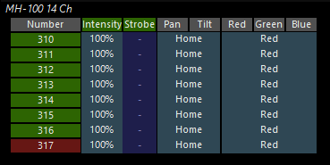
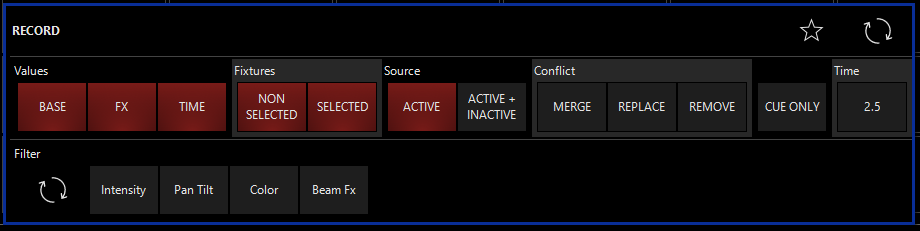

# Cues

## Wo hin mit der Cue?

Es gibt 3 Orte an dene Cues recorded werden können: 

- Main Playback (Fader 1-10) 
- Sub Playback (Fader 11-20)
- Playback Buttons

Strenggenommen ist es egal an welchen Ort man eine Cue recorded da die Kontrollmöglichkeiten überall die gleichen sind. Trotzdem sollte man sich überlegen was an welchem Ort Sinn macht. Farb Cues machen auf den Main Playback Fadern genauso wenig Sinn wie Intensity Fader auf den Playback Buttons. Im Grundsatz sollte man die Playback Buttons genauso verwenden wie Knöpfe in QLC+.

## Die erste Cue

```
>> Group/Fixtures auswählen >> Presets anwenden/Attribute verteilen
```

jetzt sind die Attribute im Programmer gespeichert.  Da immer ALLES aus dem Programmer auf einmal als eine Cue recorded wird macht es am Anfang Sinn zu kontrollieren was man überhaupt recorded. Dafür in der Sidebar den Programmer-View auswählen.

 

Die hellblau hinterlegten Felder zeigen die Namen der angewendeten Presets, die dunkelblau hinterlegten Felder die tatsächlichen Werte.

Wenn alles richtig ist nur noch auf `Record` drücken. Danach öffnet sich folgendes Dialogfeld:



### Conflict Kategorie:

| Option    | Erklährung                                                   |
| --------- | ------------------------------------------------------------ |
| `MERGE`   | Alle neune Attribute werden zu denen beriets recordeten hinzugefügt. Attribute die davor gespeichert wurden werden nicht überschrieben außer sie sind in den neuen Attributen beinhaltet. |
| `REPLACE` | Alle bereits gespeicherten Attribute werden gelöscht und mit den neune überschrieben |
| `REMOVE`  | Nur die neuen Attribute werden aus der gespeicherten Cue gelöscht. Quasi eine Möglichkeit bestimmte Attribute aus einer bereits bestehenden Cue zu löschen. |

### Source Kategorie:

| Option            | Erklährung                                              |
| ----------------- | :------------------------------------------------------ |
| `ACTIVE ONLY`     | nur aktive Attribute werden recorded                    |
| `ACTIVE+INACTIVE` | aktive und inaktive (tracked) Attribute werden recorded |

### Der `CUE ONLY` Button

Wenn ausgewählt, alle Attribute die in der Cue recorded sind werden nicht getracked. Das heißt das die Attribute nur für diese eine Cue gelten. Die einzige Ausnahme ist wenn die Cue sich am Ende der Cueliste befindet, dann werden die Attrinute trotzdem getracked.

### Fixture Kategorie

| Option         | Erklähurng                                                   |
| -------------- | ------------------------------------------------------------ |
| `SELECTED`     | Ausgewählte Fixtures(grün bzw. rot markiert) werden recorded |
| `NON-SELECTED` | nicht direkt ausgewählte Fixtures (blau bzw. dunkelgrün markiert) werden recorded |

### Filter Kategorie

| Option      | Erklährung                                         |
| ----------- | -------------------------------------------------- |
| `INTENSITY` | Nur Attribute der Intensity gruppe werden recorded |
| `PAN TILT`  | Nur Attribute der Pan Tilt gruppe werden recorded  |
| `COLOR`     | Nur Attribute der Color gruppe werden recorded     |
| `GOBO`      | Nur Attribute der Gobo gruppe werden recorded      |
| `BEAM`      | Nur Attribute der Beam gruppe werden recorded      |
| `BEAM FX`   | Nur Attribute der Beam FX gruppe werden recorded   |
| `FRAMING`   | Nur Attribute der Framing gruppe werden recorded   |

Für den Anfang kann man alles auf default lassen, allerdings sind die Filtermöglichkeiten sehr mächtig und es lohnt sich wenn man sich mit diesen auseinander setzt.

Wenn die Filteroptionen getroffen wurden auf ein freies Feld klicken bzw. auf eine bestehende Cuelist klicken wenn man dieser eine neue Cue hinzufügen will. Danach noch einen Namen vergeben und bestätigen. Die verschieden Arten werden später erklärt.

## Was in den Cues recorden?

Diese Frage ist ziemlich wichtig und es gibt keine definitive Antwort darauf. Onyx ermöglicht es komplette Stage Looks in Cues abzuspeichern um diese jederzeit wieder abzuspielen. hat man nur solche Cues verliert man aber viel Flexibilität und es wird schwer auf spontane Änderungen zu reagieren. Die andere Möglichkeit wäre es in jeder Cue immer nur eine Info zu speichern. Das würde bedeuten das man einzelne Cues für die Farben der verschiedenen Scheinwerfer hat, einzelne Cues für Positionen von Movingheads etc. Das bietet natürlich den höchsten Grad an Flexibilität, macht es aber geradezu unmöglich komplexe Stagelooks in kurzer Zeit zu präsentieren. Am "besten" ist eine Mischung aus beidem aber jeder muss sich selber klar werden was für seine Art die Show zu machen am besten ist. Ich bevorzuge viele kleine Cues weil ich allgemein lieber viel live mache allerdings ist mir auch bewusst das durch auch ein wenig die Komplexität leidet und alles eher einfacher gehalten ist. Wie viel man Live machen kann hängt natürlich auch von der vorhanden Hardware ab. Steht nur ein Laptop mit Maus zu Verfügung ist es viel Schwieriger versschieden Cues schnell nacheinander zu aktivieren. 

