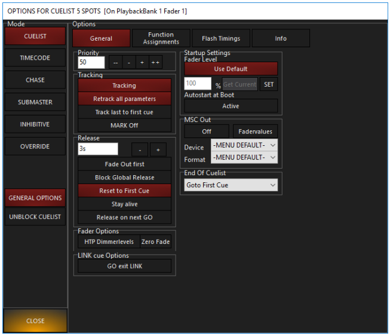
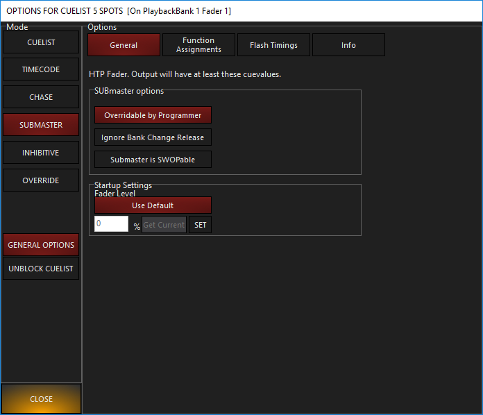
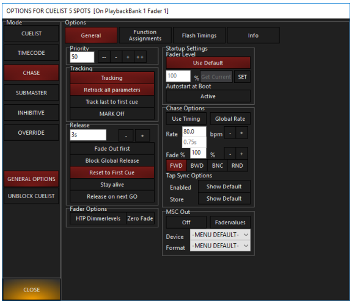

# ihre Optionen und ihre Funktionen

Beim Recorden der ersten Cue sind ja schon die verschiednen Arten von Cuelisten aufgefallen. Diese sind: 

- Cuelist
- Submaster
- Inhibitiv
- Chase
- Override/Q-Blender
- Timecode

Die Art der Cuelist kann jederzeit über die `Cuelist Options` geändert werden. Um diese zu öffnen mit rechtsklick auf die Cuelist drücken. Auf der rechten Seite kann durch klicken die Art geändert werden. Die anderen Cuelsit Options werden später behandelt.

### Cuelist (rote Farbe)

die Standard Cuelist Art. Wenn man `PLAY` drückt und der Fader auf 100% ist werden alle Parameter gleichzeitig eingefadet. **Wichtig**: der Fader kontrolliert nur die Intensität, alle anderen Attribute bleiben unangetastet.

Cuelisten haben verschieden Einstellungen. Manche von ihnen findet man auch bei anderen Arten von Cuelisten

| Option     | Erklährung                                                   |
| ---------- | ------------------------------------------------------------ |
| `PRIORITY` | Jeder Cueliste wird eine Priorität zugeordnet. Standartmäßig haben alle Cuelisten den Prioritätswert 50. Allerdings kann man in von 1-100 ändern. Eine Cueliste mit höherer Priorität hat mehr rechte als eine Cue mit weniger Priorität. Damit lästt sich die LTP Regel ein wenig modifizieren |

| Tracking Options                      | Erklährung                                                   |
| ------------------------------------- | ------------------------------------------------------------ |
| `TRACKING` default On                 | Gleich wie die `CUE ONLY ` Option im Record Menü. Nur in diesem fall gilt die Einstellung nicht nur für eine Cue sondern für die ganze Cuelist. |
| `RETRACK ALL PARAMETERS` default On   | Im Normalfall werden alle Attributsveränderungen von Cue zu Cue gespeichert. Es stellt allerdings ein Problem da wenn man nicht am Anfang der Cuelsit anfängt sondern mittendrin. Dann kann es passieren das bestimmte (im Normalfall getrackte) Attribute fehlen. Ist diese Einstellung ausgewählt schaut Onyx in den davorigen Cues nach welche Attributsverändeungen dort recored werden auch wenn man nicht bei Cue 1 anfängt. |
| `TRACK LAST TO FIRST CUE` default Off | Das normale Verhalten einer Cuelist ist das nach der letzten Cue wieder zur ersten cue gesrungen ist. Ist diese Option aus werden alle bis zur letzten Cue getrackden Attribute "gelöscht". Ist diese Option werden die Attribute weiterhin getracked. |
| `MARK OFF`default Off                 | Einstellungen für Move in Dark. Später dazu mehr             |

| Release Options                    | Erklähurng                                                   |
| ---------------------------------- | ------------------------------------------------------------ |
| `Release`                          | Hier kann man die "Fade Time" Einstellen wenn eine Cuelsit released wird. |
| `FADE OUT FIRST` default Off       | Wenn ausgewählt werden Intensity Attribute zuerst ausgefaded. Dies geschieht inder unter Release eingestellten Zeit. Sobald Die Intensity values auf 0 sind werden alle anderen Attribute ausgefaded. Wieder in der zuvor eingestellten Zeit. Effektiv wird durch diese Einstellung die Release Time verdopppelt. |
| `BLOCK GLOBAL RELEASE` default Off | Wen ausgewählt werden Globale Release Commands ignoriert. (Solche Commands währen z.b das halten der `Snap `Taste und das drücken der `Release` Taste im Playback Module bzw auf Hardware.) Diese Einstellung macht vor allen dingen Sinn für Cuelsiten in denen sich Fixtures befinden die immer an sein sollen |
| `RESET TO FIRST CUE`               | Wenn ausgewählt springt die Cuelist nachdem sie released wurde wieder auf Cue 1. Ist diese Option nicht ausgewählt bleibt die Cuelist bei der zuletzt getriggerten Cue bestehen. |
| `STAY ALIVE` (default Off)         | Am besten lässt sich das durch ausprobieren zeigen. Aber zur Erkaltung: Wenn zwei Cuelisten die gleichen Attribute der gleichen Fixtures kontrollieren wird die Cuelist die zuerst gestartet wurde automatisch released wenn die zweite gestartet wurde. Ist allerdings die `STAY ALIVE` Option ausgewählt belibt die Cue im Hintergrund noch aktiv und übernimmt dann wieder die Kontrolle wenn die zweite Cuelist released wurde |
| `RELEASE ON NEXT GO`               | Wen aktiviert wird die Cuelsit durch den nächsten GO Command der an eine andere Cuelist geht automatisch released. Diese Einstellung macht am misten Sinn für Cuelsiten die jeweils nur eine Cue mit einer Farbe gespeichert haben um eventuelles Mischen der Farben zu verhindern. |

### Submaster (grüne farbe)

HTP Fader. Wenn diese Art ausgewählt ist wird die Intensity Inforamtion aus Cue 1 vom dazugehöhrgen Fader gesteuert. Andere Cuelisten können die Intensity von Fixtures die in einem Subamster enthalten sind über den wert des Submasters bringen. Der Wert des Subamsters kann aber niemals untertroffen werden. 

(Der Release Knopf hat keinen Einfluss auf den Subamster)

Es gibt drei Submaster-eigene Einstellungen:

| Option                                     | Erklärung                                                    |
| ------------------------------------------ | ------------------------------------------------------------ |
| `Overrideable by Programmer` (default on)  | Wenn auf `ON`: Der Programmer ignoriert das Level des Submasters. Wenn auf `OFF`: Der Programmer hat keinen Einfluss auf die Level des Submasters. (Zu beachten ist allerdings das sich diese Einstellung nur auf den Konsolen Output beschränkt. Es können weiterhin Intensity Werte unabhängig vom Subamster recorded werden) |
| `Ignore Bank Change Release` (default off) | Wenn `ON` ignoriert der Submaster die `Global Submaster Reset` Einstellung. Diese findet man in den Einstellungen unter >> Show >> Settings >> Playback und beeinflusst das Verhalten des Subamsters wenn man die fader Bank wechselt. |
| `Submaster is SWOPable` (default off)      | Der `GO` Button eines Subamsters funktioniert dann als Solo Button. Das heißt das sobald  `GO`  gedrückt wurde das Intensity Level aller Cuelisten, Subamster und dem Programmer auf null geschaltet werden. |

### Inhibitiv (gelbe Farbe)

Der Inhibitive kann nicht genutzt werden um Das Intensity Level einer Fixture zu erhöhen. Stattdessen ist der Wert des Inhibitves die Obergrenze des Intensity Cahnnels. Als Beispiel: Fixture A ist per Cuelist auf 100%, ein Inhibitv der dieses Fixture enthält ist auf 25%. Das heißt das die Konsole auch nur 25% Output sendet. Zu beachten ist das Inhibitves keinen additiven Effekt auf Intensity Effekte haben. Ein auf 100% gestellter Subamster würde dafür Sorgen das ein Intensity Effekt "nicht sichbar" ist da kein Intensity Vlaue unter 100% fallen kann. Heist also das man Subamster nicht benutzen kann um Fixtures wärend eines solchen Effektes zu dimmen. Mit Inhibvitves geht das schon, weswegen dieses auch dem Subamster Fader in den meisten fällen vorzuziehen ist.

### Chase

Ein Chase ist eine Cueliste die solange looped bis sie released wird. Die Zeit die zwischen den einzelenn cues bzw. Steps verstreicht lässt sich live entweder über die eingestellte BPM, das tippen des Go buttons oder der `Global Rate`.

Es gibt ein paar Chase eigene Einstellungen:

| Option                                          | Erklärung                                                    |
| ----------------------------------------------- | ------------------------------------------------------------ |
| `USE TIMING` defaut off                         | wenn On werden recorded Zeit Attribute benutzt               |
| `GLOBAL RATE`                                   | wenn On wird die `GLOBAL RATE` benutzt. Ermöglicht auch die Benutzung des `Beat ` Buttons bzw. eines Function Keys |
| `BEATS PER MINUTE`                              | Als zeit Attribut wird BPM benutzt (einstellbar im Feld daneben). Default ist 80 BPM == 1 step alle 0.75 sec. (Wenn Global Rate On ist wird die Einstellung ignoriert) |
| `FADE %`                                        | Regelt die fade time zwischen den einzelnen Steps ind Prozent. Bei 100% wird die in der Cueliste recordete Fade Time angewandt, bei 50% die hälfte etc..  Wichtig: die Fade Time hat keine Einwirkung auf die Zeit zwischen einzelnen Steps. |
| `FWD` Forward; default                          | Richtung: wenn On wird die Cuelist von oben nach unten ausgeführt um dann wieder auf cue 1 zu springen. |
| `BWD` Backward                                  | Richtung: Wenn On wird die Cue Rückwärts ausgeführt, von der letzten bis zur ersten um dann wieder zur letzten zu springen. |
| `BNC` Bounce                                    | Richtung, wenn On wird die Cue erst vorwärts ausgeführt, ist das ende erreicht wird sie rückwärts ausgeführt: 1, 2, 3, 4, 3, 2, 1, 2...etc.. |
| `RND` Random                                    | Wenn On, ist die Reihenfolge der Cue zufällig                |
| `TAP SYNC OPTIONS tso`                          | auch wenn es möglich ist die Zeit zwischen den Steps per BPM zu steuern ist es auch möglich den Go Button als Geschwindigkeitsknopf zu benutzen (`TapSync`). |
| `tso:Show Default`                              | Wenn ausgewählt werden die globalen `TapSync` Optionen benutzt. Diese lassen sich im Menü unter >> Show >> Cue Setting >> TapSync einstellen |
| `tso: Enabled (Show Default ON)`                | Wenn ausgewählt kann man den GO-Button als Geschwindigkeitsregler benutzten. |
| `tso: update Cuelist Default (Show Default ON)` | Wenn ausgewählt werden alle recordeten Zeit Attribute der Cuelist überschrieben. Sobald |

### Override

Override Cuelisten sind eine Ausnahme der LTP Regel. Es gelten folgende Sachen:

- Attribute in einem Override überschreiben alle Attribute die in anderen Cuelsiten recorded wurden. Sie überschreiben nicht den Grand Master oder den Programmer.
- Es ist ein Crossfade fader. Das heißt das bei 0% der Fader keine Kontrolle über die Attribute hat. Bei 100% hat der Fader volle Kontrolle über alle eingebundenen Attribute
- Dinge wie Cuelist Priority haben keinen Effekt. Wenn zwei Overrides zur gleichen zeit auf 100% sind gilt LTP
- Es gibt kein tracking
- Die `Update` Funktion funktioniert nicht. Stattdessen `Record` oder `Edit` benutzen. (später mehr dazu)

Im Gegensazt zu normalen Cuelisten sind die Optionen `UP+GO` und `DOWN+RELEASE` standartmäßig On. In den Optionen lässt sich das aber ändern.

WICHTIG: Attribute werden von Overrides nur temporär überschrieben. Sobald der Fader wieder auf 0% ist (oder released wurde) greifen wieder die in den Cuelisten recordeten Attribute!

### Q-Blender

Eine Einstellungsmöglichkeit von Overrides ist der Q-Blender. Laut dem Werbematerial handelt es sich dabei um ein Onyx-eigenes Feature bei dem man verschiedene Cues über das hochziehen eines fader triggern kann.

Wählt man die Option `Q-BLENDER` erscheint ein neues Feld bei den Cue List Values: 

Diese Einstellung regelt bei welcher höhe des faders welche Cue getriggert werden soll. Im gezeigten Beispiel ist die erste Cue aktiv von 0%-33%. Ab 33% wird Cue 2 getriggert und bleibt bis 66% aktiv. Die `From/To` Felder können nur im `Edit Mode ` verändert werden. Werden sie nicht bearbeitet verteilen sich die Cues gleichzeitig auf den Fader und werden auch automatisch geupdated wenn eine neue Cue zur Cuelist hinzugefügt wird.

Um den Q-Blender auszuwählen, in den Optionen bei `Advanced` auf `Q-Blender ` drücken.

### Timecode

Timecode wird nicht erklärt werden da es für unsere Zwecke unbrauchbar ist. Als ob sich ne Bläserklasse an den Takt halten könnte. Wen es interessiert kann den Artikel im Onyx Handbuch lesen.