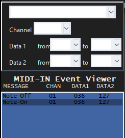
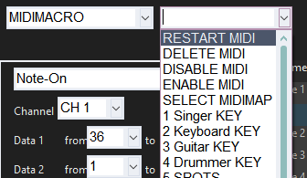
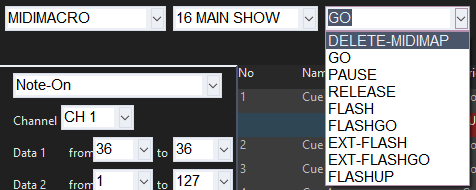
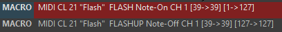

# MIDI MACROS

Cuelisten nur über einen Touchscreen bzw. mit der Maus zu triggern ist umständlich und nicht sonderlich schnell. Besonders bei Veranstaltungen wie Partys bei denen man wenig Vorprogrammierten kann. Für solche Fälle kann man Cuelisten auch per Midi Controller triggern. 

Bei Midi Controllern gibt es zwei Unterschide, generische von AKAI, Novation etc und Onyx eigene Wings wie das NX Wing oder das NX Touch. NX Wing und NX Touch funktionieren zwar auch über das Midi Protokoll allerdings sind diese Plug and Play. Wir behandeln hier Generische Midi Controller. 

Für Beispielzwecke benutze ich ein AKAI LPD8 und ein DIY Midi Controller, man kann alles allerings analog auch auf andere übertragen. 

### Limitationen

Ohne externe Software ermöglicht Onyx uns nur das Triggern, Releasen und Flashen von Cuelisten. Es ist nicht möglich den fader einer Cuelsit mit einem Midi fader zu kontrollieren. Das geht nur mit einem Programm ShowCockpit oder via TouchOSC und einem Tablet. 

Eine weiter Limitation ist das Onyx keine Midi Signale ausgibt. Das klingt zuerst nicht weiter wichtig, heißt allerdings das Status LEDs, die am Midi Controller eingebaut sind, nicht auf den Status einer Cuelist reagieren können. (Auch das geht nur mit ShowCockpit)

### Grundlagen von MIDI

Midi steht für **Musical Instrument Digital Interface** und ist eigentlich ein Protokoll für den Austausch von Informationen zwischen elektronischen Instrumenten. Allerdings kann man genau diese Informationen auch benutzen um bestimmte Aktionen in Programmen zu triggern. Ein MIDI Signal besteht aus verschieden Teilen, allerdings brauchen wir nicht alle in Onyx. Was bei einem Tastendruck eines MIDI Controllers übertragen wird lässt sich am einfachsten mit einem Programm wie MIDI-OX anzeigen.

Folgende Bestandteile eines MIDI Events gibt es: 

| Teil                          | Erklährung                                                   |
| ----------------------------- | ------------------------------------------------------------ |
| Timestamp                     | Irrelevant für Onyx                                          |
| Event Type (In Onyx: Message) | Es gibt verschiedene Event Types, Note-On, Note-Off etc, gleich mehr dazu |
| In                            | Irrelevant für Onyx                                          |
| Port                          | Irrelevant für Onyx                                          |
| Status                        | Irrelevant für Onyx                                          |
| Data1                         | Erstes Datenfeld                                             |
| Data2                         | Zweites Datenfeld                                            |
| Channel                       | Der Channel des jeweiligen Knopfes etc. Durch verschieden Channels lassen sich verschiedene Midi Signale über den gleichen Knopf senden |
| Note                          | Die ursprüngliche Note des Midi Signals; Irrelevant für Onyx |

(Wer ein wenig erfahrng mit Midi Signalen hat weiß warschienlich das es zusätzlich noch note Velocity gibt. Die meisten Midi Controller die für uns relevant sind senden diese Signal nichtmal mit da es keine Möglichkeit für den Benutzer gibt diesen Wert zu verändern)

Wie man sehen kann ist ein großteil des Midi Standarts für uns komplett egal, dies ist übrigens keine Eigenheit von Onyx sondern bei den meisten Modernen Programmen der Fall. Kaum noch Software hält sich an die ursprüngliche Semantik eines Midi Signals.

Folgende Event Types kann Onyx verarbeiten:

| Event Type      | Erklährung                                                   |
| --------------- | ------------------------------------------------------------ |
| Note-On         | Wird gesendet sobald ein Knopf gedrückt wird                 |
| Note-Off        | Wird (bei den meisten Midi Controllern) automatisch gesendet sobald der Knopf losgelassen wird. Ein Tastendruck besteht also immer aus einem Note-on und einem Note-Off Event. |
| Key-After       | Irrelevant für Onyx                                          |
| Ctrl-Change     | Wird mit CC abgekürzt, ändert den Zustand des angeschloseenen Controllers. kann aber auch die Art Signal sein die gesendet wird wenn ein Potentiometer/fader bedient wird |
| Programm Change | Irrelevant für Onyx                                          |
| Channel After   | Irrelevant für Onyx                                          |
| Pitch           | Irrelevant für Onyx                                          |

Der einzige wirklich wichtige Event Type für uns ist allerdings Note- On und Note-Off. 

### MIDI Controller in ONYX

Zuerst sollte man sich sicher sein das der Midi Controller auch von Onyx erkannt wird. Dafür 

```
>> Onyx Menu >> IO Settings >> MIDI Devices
```

Wenn es erkannt wurde sollte es dort auftauchen. Dort kann es außerdem an und ausgeschaltet werden. Sollte es nicht erkannt werden auf Scan For Devices drücken oder Onyx neu starten.  (Die MIDI Settings sind für generische Midi Controller nicht relevant).

### MIDI Macro einer Cuelist hinzufügen

Um einer Cueliste ein MIDI Macro hinzuzufügen:

```
>> Cuelsit selecten >> Cuelist values View >> Edit Mode >> ADD MACRO
```

(es macht für MIDI Macros keinen unterschied ob es bei Cue 1 oder Cue 10 steht)

Wenn ein Macro hinzugefügt wurde auf `UNDEFINED MACRO` klicken und aus dem Drop-Down Menu MIDIMACRO auswählen. dann öffnet sich folgender Bildschirm:

*

Im MIDI-IN Event Viewer kann man alles gesendeten MIDI Werte sehen. Dabei ist die neueste MIDI Nachricht immer ganz oben. 

Um nun Onyx zu sagen bei welchem MIDI Signal er was machen soll müssen zuerst die leeren Felder über dem Event Viewer ausgefüllt werden. Um diese automatisch zu füllen einfach auf die gewünschte MIDI Message im Event Viewer drücken. In den meisten Fällen ist das ein Note-On Event.

Danach muss im Drop-Down Menu neben dem MIDIMACRO entweder die Cuelist die manipuliert werden soll oder ein globales MIDIMacro ausgewählt werden

 

Zur Erklärung der globalen MIDIMacros:

| Option           | Erklährung                                                   |
| ---------------- | ------------------------------------------------------------ |
| `RESTART MIDI`   | hat zur Zeit keine Funktion                                  |
| `DELETE MIDI`    | Stoppt das empfangen von MIDI Signalen für ALLE MIDIMacros. Damit die Macros wieder Signale empfangen können müssen die entsprechenden Cuelisten erneut executed werden |
| `DISABLE MIDI`   | Ignoriert alle einkommenden MIDI Signale ohne sie auszuschalten |
| `ENABLE MIDI`    | Wenn `DISABLE MIDI` aktiviert werden dadurch MIDI Signale nicht mehr ignoriert |
| `SELECT MIDIMAP` | hat zur Zeit keine Funktion                                  |

Möchte man allerdings einfach nur eine Cuelist triggern muss in dem Drop Down Menu die entsprechende Aktion ausgewählt werden:

 *

Es gibt folgende Optionen:

| Option           | Erklähurng                                                   |
| ---------------- | ------------------------------------------------------------ |
| `DELETE MIDIMAL` | Hat zur Zeit keine Funktion                                  |
| `GO`             | gleicher Effekt wie ein Go Button                            |
| `PAUSE`          | Pausiert den fade oder den laufenden Effekt                  |
| `RELEASE`        | Released die Cuelsit                                         |
| `FLASH`          | Gleichen Effekt wie den Flash Button gedrückt zu halten      |
| `FLASHGO`        | Flasht die Cuelist und sendet danach einen Go Command        |
| `EXT-FLASH`      | Ähnlich zum Flash Command, allerdings ist der wert auf den geflasht wird von DATA2 abghängig |
| `EXT-FLASHGO`    | Ähnlich zu FlashGo, allerdings wird wieder DATA2 für den Flash Wert genutzt |
| `FLASHUP`        | Äquivalent zu den Finger vom Flash Button zu nehmen, beendet also den Flash |

Sind alle Einstellungen getroffen noch auf Apply drücken und fertig ist das MIDI Macro. 

Wie man in diesem Beispiel sehen kann sendet das Macro ein Go Command an Cuelsit 16 "MAIN SHOW" sobald ein MIDI Signal mit Channel 1, einem DATA 1 Wert 36 und irgendeinem DATA2 Wert empfangen wird. Dieses Signal wird gesendet sobald Pad1 des LPD8 getriggert wurde

## WICHTIG: wenn ein neues MIDI Macro erstellt, eine Veränderung vorgenommen wurde oder die Konsole neu gestartet wurde muss die Cuelsite in dem das MIDI Macro gespeichert wurde neu getriggert werden.

## WICHTIG: Wenn ein MIDI Macro einmal gestartet wurde wird es immer weiter MIDI Siganle empfangen und akzeptieren. Auch dann noch wenn die Cue oder das Macro gelöscht wurden. Um ein MIDI Macro zu löschen muss man erst das Macro löschen und dann die DELETE MIDI Funktion nutzen.

### Tipps für MIDI Macros

1. Wie grade gesagt muss man immer die Cuelist mit dem MIDI Macro neu starten nachdem das Showfile neu geladen wurde. Deswegen macht es Sinn eine leere Cuelist mit nur einer Cue zu haben in der alle MIDI Macros gespeichert sind.
2. Es macht immer Sinn 3 Cuelisten zu haben in denen die drei Globalen MIDI Macros gespeichert Sinn. Vor allen dingen `DISABLE MIDI` kann extrem praktisch sein.  
3. Wie erstellt man ein Macro das eine Cuelist nur solange triggerd wie ein Knopf auch gedrückt wird? dafür erstellt man 2 MDI Macros, eins mit dem `NOTE ON` Event und eins mit dem `NOTE OFF` Event des gleichen Buttons. Wie bereits beschrieben wird ein Note Off Event gesendet sobald der Knopf deaktiviert wird. Als Aktion kann man entweder Go und Release benutzen (das macht am meisten Sinn für Cues die bei den Playback Buttons gespeichert sind) oder man benutzt die Flash und Flash-Up Aktion (damit das allerdings auch Funktioniert muss die Cuelist zuerst getriggert werden und der Fader auf 0% sein. Als Erinnerung, der Flash Button flasht nur die Intensity der Cue auf 100%.)  hier sieht man ein Beispiel bei dem die Flash und Flash-Up Variante gewählt wurde.

